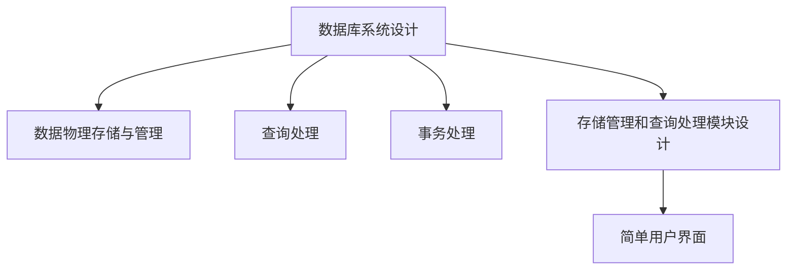

# 数据库系统概念

## 计算机系统：数据 + 处理
---

- 许多与处理相关的课程
- 较少与数据相关的课程
- 数据生成、传输、存储、安全、清洗、共享、访问等
- 不同数据类型：非结构化、半结构化、结构化
- 不同数据量
- 不同数据访问需求：写密集型、读密集型、严格事务、分析、训练、推理

## 关系型数据库系统概念
---

- 关系型数据库系统如何工作（数据组织、查询和更新）
- 如何设计数据库（针对特定应用的数据库系统中数据的结构）
- 如何在设计的数据库上进行基本编程

=== "核心功能"
    - 数据存储
    - 数据检索
    - 数据更新
    - 事务处理

=== "设计目标"
    - 数据一致性
    - 数据安全性
    - 高效访问
    - 并发控制

## 数据相关问题（以选课系统为例）
---

- 数据存储位置
- 数据组织方式
- 数据访问方法
- 如何高效访问数据
- 如何确保数据安全
- 如何确保数据一致性
- 如何服务不断增加的用户（并发访问）

## 文件系统存储数据的缺点
---

!!! danger "文件系统的主要问题"
    文件系统在处理企业级数据时存在多种固有缺陷，数据库系统则专门设计用来克服这些缺陷。

<div class="grid cards" markdown>

- :material-database-refresh:{ .lg .middle } __数据冗余和不一致性__

    ---
    
    多种文件格式，不同文件中信息重复

- :material-database-search:{ .lg .middle } __数据访问困难__

    ---
    
    每项新任务都需要编写新程序

- :material-database-lock:{ .lg .middle } __完整性问题__

    ---
    
    完整性约束（如账户余额 > 0）被"埋藏"在程序代码中而非明确声明
    
    难以添加新约束或更改现有约束

- :material-sync:{ .lg .middle } __更新的原子性__

    ---
    
    故障可能使数据库处于不一致状态，仅执行部分更新
    
    示例：从一个账户向另一个账户转账应该完全完成或根本不发生

- :material-account-multiple:{ .lg .middle } __多用户并发访问__

    ---
    
    需要并发访问以提高性能
    
    不受控制的并发访问可能导致不一致
    
    示例：两人同时读取余额（假设为100）并更新（各取50）

- :material-shield-lock:{ .lg .middle } __安全性问题__

    ---
    
    难以提供用户对部分而非全部数据的访问权限

</div>

!!! success "解决方案"
    数据库系统为上述所有问题提供解决方案。

## 数据库管理系统（DBMS）
---

- DBMS包含有关特定企业的信息
  - 相互关联的数据集合
  - 访问数据的程序集
  - 便捷高效的使用环境

!!! example "数据库应用"

    <div class="grid" markdown>
    
    <div markdown>
    * 银行：交易
    * 航空公司：预订、时刻表
    * 大学：注册、成绩、在线教育
    </div>
    
    <div markdown>
    * 销售：客户、产品、购买
    * 在线零售商：订单跟踪、个性化推荐
    * 制造业：生产、库存、订单、供应链
    </div>
    
    <div markdown>
    * 人力资源：员工记录、薪资、税收减免
    * 社交媒体：用户关系、内容推送
    * 医疗健康：患者记录、诊断历史
    </div>
    
    </div>

- 数据库可能非常大
- 数据库触及我们生活的各个方面

## 数据的不同层次
---

<div class="grid cards" markdown>

- :material-database:{ .lg .middle } __物理层（Physical level）__

    ---
    
    描述记录（如客户）的存储方式
    
    关注数据在磁盘上的位置、组织方式、存储介质等

- :material-table:{ .lg .middle } __逻辑层（Logical level）__

    ---
    
    描述存储在数据库中的数据及其之间的关系
    
    示例：
    ```
    type instructor = record
      ID : string;
      name : string;
      dept_name : string;
      salary : integer;
    end;
    ```

- :material-eye:{ .lg .middle } __视图层（View level）__

    ---
    
    应用程序隐藏数据类型的详细信息
    
    视图也可以出于安全目的隐藏信息（如员工工资）

</div>

## 数据模型
---

数据模型是描述以下内容的工具集合：
- 数据
- 数据关系
- 数据语义
- 数据约束

常见的数据模型包括：

<div class="grid" markdown>

<div markdown>
| 数据模型 | 特点 |
| --- | --- |
| 关系模型（Relational Model） | 以表格形式表示数据，如：department(dept_name, building, budget) |
| 实体-关系模型（Entity-Relationship Model） | 主要用于数据库设计，包含实体（客观存在的事物）、关系（实体之间的联系）和属性（实体的特征） |
</div>

<div markdown>
| 数据模型 | 特点 |
| --- | --- |
| 对象模型（Object-based Model） | 对象导向和对象关系模型，包含对象（客观事物的抽象）、属性（对象特征）和操作（对象可执行的操作） |
| 半结构化数据模型（Semistructured Data Model） | 如XML，数据结构不固定 |
| 其他较早的模型 | 网状模型（Network Model）、层次模型（Hierarchical Model） |
</div>

</div>

## 实例和模式
---

=== "模式（Schema）"
    - 数据库的逻辑结构
    - 与编程语言中的类型信息类似
    - 示例：数据库包含有关客户、账户集合及其关系的信息
    - 物理模式：物理层的数据库设计
    - 逻辑模式：逻辑层的数据库设计

=== "实例（Instance）"
    - 特定时间点数据库的实际内容
    - 与变量的值类似

=== "物理数据独立性"
    - 能够修改物理模式而不改变逻辑模式
    - 应用程序依赖于逻辑模式
    - 通常，各级和组件之间的接口应该明确定义，以便某些部分的更改不会严重影响其他部分

## 关系模型
---

- 表格形式的数据示例：
  - 行（Rows）
  - 列（Columns）

## 数据定义语言（DDL）
---

- 用于定义数据库模式的规范符号
- 示例：
  ```sql
  create table instructor (
    ID char(5),
    name varchar(20),
    dept_name varchar(20),
    salary numeric(8,2)
  )
  ```

!!! info "DDL详细说明"
    - DDL编译器生成存储在数据字典中的一组表模板
    - 数据字典包含元数据（即关于数据的数据）：
      - 数据库模式
      - 完整性约束
      - 主键（ID唯一标识教师）
      - 参照完整性（SQL中的引用约束）
      - 值约束
      - 授权

## 数据操作语言（DML）
---

<div class="grid cards" markdown>

- :material-code-json:{ .lg .middle } __DML概述__

    ---
    
    用于访问和操作由适当数据模型组织的数据的语言
    
    DML也称为查询语言

- :material-function-variant:{ .lg .middle } __DML分类__

    ---
    
    过程性语言 - 用户指定需要什么数据以及如何获取这些数据。关系代数是过程性的
    
    声明性（非过程性）语言 - 用户指定需要什么数据，而不指定如何获取这些数据

</div>

- SQL是使用最广泛的查询语言

## SQL
---

=== "基本查询示例"
    查找ID为22222的教师的姓名
    ```sql
    select name
    from instructor
    where instructor.ID = '22222'
    ```

=== "多表联合查询"
    查找物理系教师的ID和大楼
    ```sql
    select instructor.ID, department.building
    from instructor, department
    where instructor.dept_name = department.dept_name and
          department.dept_name = 'Physics'
    ```

=== "应用程序访问方式"
    - 允许嵌入SQL的语言扩展
    - 应用程序接口（如ODBC/JDBC），允许将SQL查询发送到数据库

## 数据库设计
---

设计数据库通用结构的过程：

<div class="grid cards" markdown>

- :material-puzzle:{ .lg .middle } __逻辑设计__

    ---
    
    决定数据库模式。数据库设计要求我们找到"良好"的关系模式集合。
    
    业务决策 - 我们应该在数据库中记录哪些关系模式和属性？
    
    计算机科学决策 - 如何优化模式，以及如何在各种关系模式中分配属性？

- :material-harddisk:{ .lg .middle } __物理设计__

    ---
    
    决定数据库的物理布局
    
    包括索引、存储结构、分区策略等

</div>

## 设计方法
---

<div class="grid cards" markdown>

- :material-vector-relationship:{ .lg .middle } __实体关系模型__（第6章）

    ---
    
    将企业建模为实体和关系的集合
    
    - 实体：企业中与其他对象不同的"事物"或"对象"
      - 由一组属性描述
    - 关系：多个实体之间的关联
    
    通过实体-关系图表示

- :material-table-sync:{ .lg .middle } __规范化理论__（第7章）

    ---
    
    形式化哪些设计是不好的，并进行测试
    
    基本理论：函数依赖性。示例：student_id -> student_name
    
    通过规范化过程消除数据冗余和异常

</div>

## 数据库系统内部
---

数据库系统设计包括：



## 存储管理
---

!!! note "存储管理器概述"
    存储管理器是提供数据库中存储的低级数据与DBMS查询处理器之间接口的程序模块

- 存储管理器负责以下任务：
  - 与文件管理器的交互
  - 高效存储、检索和更新数据

- 问题：
  - 存储访问（文件、缓冲区）
  - 文件组织
  - 索引和哈希
  - 事务
  - 故障恢复

<div class="grid cards" markdown>

- :material-file-lock:{ .lg .middle } __授权和完整性管理器__

    ---
    
    负责确保数据库的完整性并验证用户的访问权限

- :material-sync:{ .lg .middle } __事务管理器__

    ---
    
    确保数据库保持一致状态，处理事务的并发执行

- :material-folder:{ .lg .middle } __文件管理器__

    ---
    
    管理磁盘上的文件分配和空间管理

- :material-memory:{ .lg .middle } __缓冲区管理器__

    ---
    
    负责将数据从磁盘带入内存，优化I/O操作

</div>

## 查询处理
---

- 查询处理器组件包括：
  - DDL解释器 - 解释DDL语句并在数据字典中记录定义
  - DML编译器 - 将查询语言中的DML语句转换为查询评估引擎理解的低级指令的评估计划
    - DML编译器执行查询优化；即，它从各种替代方案中选择成本最低的评估计划
  - 查询评估引擎 - 执行DML编译器生成的低级指令

=== "查询处理步骤"
    1. 解析和翻译
    2. 优化
    3. 评估

=== "查询优化"
    - 评估给定查询的替代方法：
      - 等效表达式
      - 每个操作的不同算法
    
    - 每个操作的不同算法。评估查询的好方法和坏方法之间的成本差异可能非常大
      - 顺序搜索：块数 * tT + tS
      - 基于索引的搜索：(hi + 1) * (tT + tS)
    
    - 需要估计操作成本
      - 关键取决于数据库必须维护的关系统计信息
      - 需要估计中间结果的大小以计算复杂表达式的成本

## 事务管理
---

!!! info "事务概念"
    事务是在数据库应用程序中执行单个逻辑功能的操作集合

核心问题：
- 系统故障怎么办？
- 如果多个用户同时更新相同的数据怎么办？

<div class="grid cards" markdown>

- :material-database-lock-outline:{ .lg .middle } __事务管理组件__

    ---
    
    确保数据库在系统故障（如电源故障和操作系统崩溃）和事务故障的情况下仍保持一致（正确）状态

- :material-account-multiple-check:{ .lg .middle } __并发控制管理器__

    ---
    
    控制并发事务之间的交互，以确保数据库的一致性

</div>

事务管理方法：

=== "基于锁的并发控制"
    - 使用锁机制防止多个事务同时修改相同数据
    - 锁类型：共享锁、排他锁
    - 两阶段锁协议

=== "基于日志的恢复"
    - 记录所有修改操作
    - 提供回滚和前滚机制
    - 支持系统崩溃后的数据恢复

## 数据库用户和管理员
---

<div class="grid cards" markdown>

- :material-account:{ .lg .middle } __普通用户__

    ---
    
    使用数据库应用程序的终端用户
    
    无需了解数据库内部结构

- :material-account-tie:{ .lg .middle } __应用程序员__

    ---
    
    开发数据库应用的程序员
    
    理解数据库结构和查询语言

- :material-account-wrench:{ .lg .middle } __数据库管理员__

    ---
    
    负责数据库的设计、实现和维护
    
    管理用户权限、性能优化和备份恢复

</div>

## 数据库系统历史
---

<div class="grid cards" markdown>

- :material-history:{ .lg .middle } __1950年代和1960年代早期__

    ---
    
    使用磁带进行存储的数据处理
    
    - 磁带仅提供顺序访问
    - 使用穿孔卡进行输入

- :material-harddisk:{ .lg .middle } __1960年代末和1970年代__

    ---
    
    硬盘允许直接访问数据
    
    - 网络和层次数据模型广泛使用
    - Ted Codd定义关系数据模型
      - 因此获得ACM图灵奖
      - IBM研究开始System R原型
      - UC Berkeley开始Ingres原型
      - Oracle发布第一个商业关系数据库
    - 高性能（当时标准）事务处理（OLTP）

- :material-server:{ .lg .middle } __1980年代__

    ---
    
    研究关系原型演变为商业系统
    
    - SQL成为工业标准
    - 并行和分布式数据库系统
    - 面向对象的数据库系统

- :material-warehouse:{ .lg .middle } __1990年代__

    ---
    
    - 大型决策支持和数据挖掘应用（OLAP）
    - 大型多TB数据仓库
    - Web商务兴起

- :material-cloud:{ .lg .middle } __2000年代__

    ---
    
    - NoSQL：MongoDB, Redis, HBase
    - 云数据库：Google Spanner, Amazon Aurora, 阿里云PolarDB

- :material-robot:{ .lg .middle } __现在__

    ---
    
    - 基于AI的数据库或AI支持的数据库
    - 区块链数据库

</div>

!!! note "产品演进"
    注意：后期产品并不是取代早期产品。不同产品可以满足不同的应用需求。

## 数据操作语言概念
---

<div class="grid" markdown>

<div markdown>
|概念|解释|
|---|---|
|数据定义语言(DDL)|用于定义数据库的结构，如创建、删除、修改表、视图、索引等|
|数据操纵语言(DML)|用于操作数据库中的数据，如插入、删除、更新数据等|
</div>

<div markdown>
|概念|解释|
|---|---|
|数据查询语言(DQL)|用于查询数据库中的数据，如SELECT、WHERE、ORDER BY等|
|SQL|结构化查询语言，是关系模型的标准语言，用于定义、操纵、查询关系型数据库|
</div>

</div>

## pdf资料

<embed src="pdfs/ch1(4).pdf" type="application/pdf" width="100%" height="400px" />