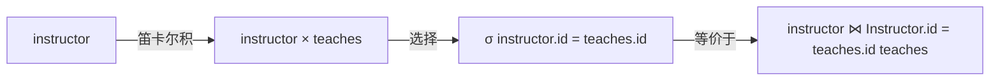

# 关系型模型

## 关系基础
---

在关系型数据库中，关系（Relation）是一种数据结构，用表格形式表示。

!!! question "思考"
    在以下选项中，哪些是关系（可多选）：
    1. 你和你的宠物狗之间的关系（relationship）
    2. 你和你的银行账户之间的关系（relationship）
    3. 一个足球队中的所有成员（relation）
    4. 目前在上这门课的所有学生（relation）

<div class="grid cards" markdown style="overflow-x: auto;">

- :material-table:{ .lg .middle } __关系的基本结构__

    ---
    
    关系是一个二维表格，由属性（列名）和元组（行）组成
    
    元组的顺序是无关紧要的（元组可以以任意顺序存储）

- :material-format-letter-case:{ .lg .middle } __关系的表示法__

    ---
    
    * $A_1, A_2, ..., A_n$ 是属性
    * $R = (A_1, A_2, ..., A_n)$ 是关系模式
    * 例如：instructor = (ID, name, dept_name, salary)
    
    形式上，给定集合 $D_1, D_2, ..., D_n$，关系 $r$ 是 $D_1 \times D_2 \times ... \times D_n$ 的一个子集

</div>

!!! info "命名规则"
    大写的"$R$"表示关系模式，小写的"$r$"表示关系实例。$r(R)$表示基于关系模式"$R$"的关系实例"$r$"。
    
    * $R$ 和 $r$ 都是集合
    * $R$ 是属性集
    * $r$ 是元组集
    * 表（Table）是关系实例的另一种表示方式

## 域（Domain）
---

- 每个属性允许取值的集合被称为该属性的域（domain）
- 属性值（通常）要求是原子的，即不可分割的
  - 严格不可分割的例子：分开存储姓和名，姓："张"，名："三"
  - 如果不经常按姓或名查询，可以在一个属性中存储全名，例如：name："张三"
  - 非原子示例：在一个属性中存储两个电话号码；在一个属性中存储书籍的所有信息，包括作者、标题、出版商等
- 特殊值null是每个域的成员。Null表示值未知或不存在
  - 例如：学期域：春季、夏季、秋季、冬季、null
  - 例如：成绩域：整数0到100，以及null
- null值在许多操作的定义中造成复杂性

## 数据库设计
---

- 数据库由多个关系组成
- 关于企业的信息被分解成多个部分
  - instructor（教师）
  - student（学生）
  - advisor（导师）

!!! danger "不良设计示例"
    univ (instructor-ID, name, dept_name, salary, student_Id, ..)
    
    这样设计会导致：
    
    - 信息重复（例如，两个学生有相同的教师）
    - 需要使用null值（例如，表示没有导师的学生）

- 规范化理论处理如何设计"良好的"关系模式
- 数据库模式 -- 是数据库的逻辑结构
- 数据库实例 -- 是某一时刻数据库中数据的快照

## 键（Key）
---

<div class="grid cards" markdown style="overflow-x: auto;">

- :material-key:{ .lg .middle } __超键（Superkey）__

    ---
    
    设 $K \subseteq R$
    
    如果 $K$ 的值足以在每个可能的关系 $r$ 中标识唯一的元组，那么 $K$ 是 $R$ 的超键
    
    示例：{ID} 和 {ID, name} 都是 instructor 的超键

- :material-key-plus:{ .lg .middle } __候选键（Candidate Key）__

    ---
    
    如果超键 $K$ 中的属性数量是最小的（如果我们移除 $K$ 中的任何一个属性，$K$ 将不再是超键），则 $K$ 是候选键
    
    示例：{ID} 是 Instructor 的候选键
    
    候选键可以有多个属性
    
    示例：grade(student_id, course_id, grade)

- :material-key-star:{ .lg .middle } __主键（Primary Key）__

    ---
    
    从候选键中选择一个作为主键
    
    示例：student(student_id, name, mobile_phone, email)
    
    有多少个候选键？哪一个将成为主键？

- :material-key-link:{ .lg .middle } __外键（Foreign Key）__

    ---
    
    外键约束：一个关系中的值必须出现在另一个关系中
    
    引用关系（Referencing relation）；被引用关系（Referenced relation）
    
    示例：instructor 中的 dept_name 是从 instructor 引用 department 的外键

</div>

## 关系代数
---

关系代数是一种过程性语言，但不是传统的编程语言。输入和输出都是关系。

=== "基本运算符"
    1. 单关系运算：
          - 选择（select）: $\sigma$
          - 投影（project）: $\pi$
          - 重命名（rename）: $\rho$
    
    2. 双关系运算：
          - 并（union）: $\cup$
          - 差（set difference）: $-$
          - 笛卡尔积（Cartesian product）: $\times$

=== "附加运算"
    可以用基本运算表示的操作，例如：
    - 交集可以用差集表示

=== "扩展运算"
    不能用基本运算表示的操作，主要是聚合函数

### 六个基本运算符
---

<div class="grid cards" markdown style="overflow-x: auto;">

- :material-filter:{ .lg .middle } __选择（SELECT）- $\sigma$__

    ---
    
    选择操作选择满足给定谓词的元组
    
    表示法：$\sigma_{p}(r)$，其中 $p$ 是选择谓词
    
    谓词 $p$ 是由以下术语通过 $\wedge$（与）、$\vee$（或）、$\neg$（非）连接的命题演算公式：

    - &lt;属性&gt; op &lt;属性&gt; 或 &lt;常量&gt;
    - 其中 op 是：=, ≠, >, ≥, <, ≤ 中的一个
    
    示例：
    
    $\sigma_{\text{dept_name="Physics"}}(\text{instructor})$
    
    $\sigma_{\text{dept_name="Physics"} \wedge \text{salary} > 50000}(\text{instructor})$

- :material-table-column:{ .lg .middle } __投影（PROJECT）- $\pi$__

    ---
    
    返回关系中选定的列，去除其他列
    
    表示法：$\pi_{A_1, A_2, ..., A_k}(r)$
    
    其中 $A_1, A_2$ 是属性名，$r$ 是关系名
    
    结果是通过删除未列出的列获得的 $k$ 列关系
    
    结果中将删除重复的行，因为关系是集合
    
    示例：
    
    $\pi_{\text{ID, name, salary}}(\text{instructor})$
    
    $\pi_{\text{course_id}}(\sigma_{\text{semester="Fall"} \wedge \text{year=2009}}(\text{section}))$

- :material-set-merge:{ .lg .middle } __并（UNION）- $\cup$__

    ---
    
    并操作允许我们组合两个关系
    
    表示法：$r \cup s$
    
    要求：
    1. $r$ 和 $s$ 必须具有相同的元数（相同数量的属性）
    2. 属性域必须兼容
    
    结果中将删除重复的行
    
    示例：查找在2009年秋季学期或2010年春季学期或两者都开设的所有课程
    
    $\pi_{\text{course_id}}(\sigma_{\text{semester="Fall"} \wedge \text{year=2009}}(\text{section}))$
    $\cup$ 
    $\pi_{\text{course_id}}(\sigma_{\text{semester="Spring"} \wedge \text{year=2010}}(\text{section}))$

- :material-set-left:{ .lg .middle } __差（DIFFERENCE）- $-$__

    ---
    
    差集操作允许我们找出存在于一个关系中但不存在于另一个关系中的元组
    
    表示法：$r - s$
    
    要求：
    1. $r$ 和 $s$ 必须具有相同的元数
    2. $r$ 和 $s$ 的属性域必须兼容
    
    示例：查找在2009年秋季学期开设但不在2010年春季学期开设的所有课程
    
    $\pi_{\text{course_id}}(\sigma_{\text{semester="Fall"} \wedge \text{year=2009}}(\text{section}))$
    $-$
    $\pi_{\text{course_id}}(\sigma_{\text{semester="Spring"} \wedge \text{year=2010}}(\text{section}))$

- :material-table-pivot:{ .lg .middle } __笛卡尔积（CARTESIAN PRODUCT）- $\times$__

    ---
    
    笛卡尔积操作允许我们组合任何两个关系中的信息
    
    表示法：$r \times s$
    
    假设 $r(R)$ 和 $s(S)$ 的属性是不相交的（即 $R \cap S = \emptyset$，或者没有相同名称的属性）
    
    如果 $r(R)$ 和 $s(S)$ 的属性不是不相交的，则必须使用重命名
    
    结果关系可能非常庞大，在实际应用中，大多数结果元组可能无用
    
    在数据库应用中，"$\times$"可能是除"$\sigma$"之外使用最频繁的操作，因为数据库由许多相互关联的关系组成

- :material-rename:{ .lg .middle } __重命名（RENAME）- $\rho$__

    ---
    
    允许我们用多个名称引用关系
    
    表示法：$\rho_{X}(E)$ - 返回表达式 $E$ 并将其命名为 $X$
    
    如果关系代数表达式 $E$ 的元数为 $n$，则 $\rho_{X(A_1, A_2, ..., A_n)}(E)$ 返回表达式 $E$ 的结果，命名为 $X$，并将属性重命名为 $A_1, A_2, ..., A_n$

</div>

### 连接（JOIN）操作
---

连接操作允许我们将选择操作和笛卡尔积操作组合为单个操作。



示例：

```sql
σ instructor.id = teaches.id (instructor × teaches)
```

等价于：

```sql
instructor ⋈ Instructor.id = teaches.id teaches
```

### 复合表达式
---

可以使用多个操作构建表达式，例如：

$\pi_{A,C}(r \times s)$

复杂查询示例：

查找物理系的所有教师姓名以及他们教授的所有课程的 course_id

查询1：
```
π instructor.name,course_id (σ dept_name="Physics" (σ instructor.ID=teaches.ID (instructor × teaches)))
```

查询2：
```
π instructor.name,course_id (instructor.ID=teaches.ID (σ dept_name="Physics" (instructor) × teaches))
```

### 附加关系运算
---

<div class="grid cards" markdown style="overflow-x: auto;">

- :material-set-center:{ .lg .middle } __交（INTERSECTION）- $\cap$__

    ---
    
    交集操作允许我们找到存在于两个输入关系中的元组
    
    表示法：$r \cap s$
    
    假设：
    - $r$ 和 $s$ 具有相同的元数
    - $r$ 和 $s$ 的属性是兼容的
    
    注意：$r \cap s = r - (r - s)$

- :material-arrow-decision-auto:{ .lg .middle } __自然连接（NATURAL JOIN）- $\bowtie$__

    ---
    
    表示法：$r \bowtie s$
    
    让 $r$ 和 $s$ 分别是基于模式 $R$ 和 $S$ 的关系，则 $r \bowtie s$ 是基于模式 $R \cup S$ 的关系，
    
    如果 $t_r$（从 $r$ 中）和 $t_s$（从 $s$ 中）在 $R \cap S$ 中的每个属性上具有相同的值，则将元组 $t$ 添加到结果中
    
    示例查询：查找计算机科学系的所有教师姓名及其教授的所有课程标题
    
    $\pi_{\text{name, title}}(\sigma_{\text{dept_name="Comp. Sci."}}(\text{instructor} \bowtie \text{teaches} \bowtie \text{course}))$
    
    自然连接是可结合的：$(\text{instructor} \bowtie \text{teaches}) \bowtie \text{course}$ 等价于 $\text{instructor} \bowtie (\text{teaches} \bowtie \text{course})$
    
    自然连接是可交换的：$\text{instructor} \bowtie \text{teaches}$ 等价于 $\text{teaches} \bowtie \text{instructor}$

- :material-approximately-equal:{ .lg .middle } __赋值（ASSIGNMENT）- $\leftarrow$__

    ---
    
    赋值操作提供了一种表达复杂查询的便捷方式
    
    可以将临时结果分配给临时关系变量
    
    复杂查询由一系列赋值组成，后跟一个表达式，其值显示为查询结果
    
    示例：
    
    $d \leftarrow \sigma_{\text{department = "physics"}}(\text{instructor})$
    
    $\text{result} = $
    $\pi_{\text{instructor.ID}}(\sigma_{\text{instructor.salary > d.salary}}(\text{instructor} \times d))$

- :material-table-sync:{ .lg .middle } __外连接（OUTER JOIN）__

    ---
    
    连接操作的扩展，避免信息丢失
    
    计算连接，然后将一个关系中与另一个关系中的元组不匹配的元组添加到连接结果中
    
    使用null值（表示值未知或不存在）
    
    主要类型：
    
    - 左外连接：$r \leftouterjoin s$
    - 右外连接：$r \rightouterjoin s$
    - 全外连接：$r \fullouterjoin s$
    
    外连接可以使用基本操作表示，例如：
    
    $r \leftouterjoin s$ 可以写成 $(r \bowtie s) \cup (r - \pi_R(r \bowtie s)) \times \{(\text{null}, ..., \text{null})\}$

- :material-division:{ .lg .middle } __除（DIVIDE）- $\div$__

    ---
    
    给定关系 $r(R)$ 和 $s(S)$，其中 $S \subset R$，$r \div s$ 是最大关系 $t(R-S)$，使得 $t \times s \subseteq r$
    
    例如，设 $r(ID, \text{course_id}) = \pi_{ID, \text{course_id}}(\text{takes})$ 和 $s(\text{course_id}) = \pi_{\text{course_id}}(\sigma_{\text{dept_name="Biology"}}(\text{course}))$，
    
    则 $r \div s$ 给出了已修过生物系所有课程的学生
    
    可以使用基本运算表示除法：
    
    $\text{temp1} \leftarrow \pi_{R-S}(r)$
    
    $\text{temp2} \leftarrow \pi_{R-S}((\text{temp1} \times s) - \pi_{R-S,S}(r))$
    
    $\text{result} = \text{temp1} - \text{temp2}$

</div>

### 扩展关系运算
---

<div class="grid cards" markdown style="overflow-x: auto;">

- :material-calculator-variant:{ .lg .middle } __广义投影（GENERALIZED PROJECTION）__

    ---
    
    通过允许在投影列表中使用算术函数来扩展投影操作
    
    表示法：$\pi_{F_1, F_2, ..., F_n}(E)$
    
    其中 $E$ 是任何关系代数表达式，
    
    每个 $F_1, F_2, ..., F_n$ 都是涉及 $E$ 模式中的常量和属性的算术表达式
    
    示例：从关系 instructor(ID, name, dept_name, salary) 中获取相同信息，但使用月薪
    
    $\pi_{\text{ID, name, dept_name, salary/12}}(\text{instructor})$

- :material-poll:{ .lg .middle } __聚合函数（AGGREGATE FUNCTIONS）__

    ---
    
    聚合函数接受值集合并返回单个值作为结果
    
    - avg：平均值
    - min：最小值
    - max：最大值
    - sum：值的总和
    - count：值的数量
    
    关系代数中的聚合操作：
    
    $_{G_1, G_2, ..., G_n} \mathcal{G}_{F_1(A_1), F_2(A_2), ..., F_n(A_n)}(E)$
    
    $E$ 是任何关系代数表达式
    
    $G_1, G_2, ..., G_n$ 是要分组的属性列表（可以为空）
    
    每个 $F_i$ 是聚合函数
    
    每个 $A_i$ 是属性名
    
    示例：查找每个系的平均工资
    
    $_{\text{dept_name}} \mathcal{G}_{\text{avg(salary)}}(\text{instructor})$
    
    聚合的结果没有名称，可以使用重命名操作为其命名：
    
    $_{\text{dept_name}} \mathcal{G}_{\text{avg(salary) as avg\_sal}}(\text{instructor})$

</div>

## 数据库修改操作
---

数据库的内容可以使用以下操作进行修改：

- 删除（Deletion）
- 插入（Insertion）
- 更新（Updating）

所有这些操作都可以使用赋值运算符表示。

## NULL值处理
---

- 元组的某些属性可能有null值，用null表示
- null表示未知值或值不存在
- 任何涉及null的算术表达式的结果都是null
  - 5 + null = null
- 聚合函数简单地忽略null值（如SQL中）
  - avg, min, max, sum, count(c)：忽略null
  - count(*)：计算记录数，如果某些记录中有null值，仍将计数
- 对于重复消除和分组，null被视为任何其他值，两个null被假定为相同（如在SQL中）

### NULL值的比较逻辑
---

- 与null值的比较返回特殊真值：unknown（未知）
- 使用未知真值的三值逻辑：
  - OR：(unknown or true) = true, (unknown or false) = unknown, (unknown or unknown) = unknown
  - AND：(true and unknown) = unknown, (false and unknown) = false, (unknown and unknown) = unknown
  - NOT：(not unknown) = unknown
  - 在SQL中，"P is unknown"在谓词P评估为unknown时计算为true
- 如果选择谓词计算为unknown，则其结果被视为false

## pdf资料

<embed src="pdfs/ch2(4).pdf" type="application/pdf" width="100%" height="400px" />