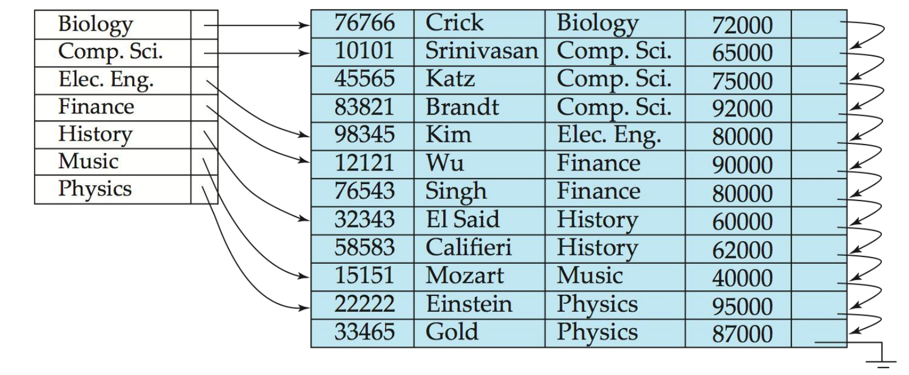

# 索引（Indexing）

## 引言

索引是数据库系统中提高数据访问效率的关键结构。本章介绍多种索引技术，包括传统的有序索引、B+树、哈希索引以及空间与时间索引等。理解这些索引结构及其适用场景，对于优化数据库性能和设计高效查询策略至关重要。

## 基本概念

<div class="grid cards" markdown>

-   :material-file-document:{ .lg .middle } __索引基础__

    ---
    索引是用于加速对所需数据访问的机制：
    
    - 类似于图书馆中的作者目录
    - 搜索键（Search Key）是用于查找记录的属性或属性集
    - 索引文件由索引项（指向实际记录的指针）组成
    - 索引文件通常比原始数据文件小得多
    - 索引按实现方式主要分为有序索引和哈希索引两类

</div>

### 索引评价标准

评价索引性能的关键因素包括：

1. **支持的访问类型**：
      - 查找具有特定属性值的记录
      - 查找属性值在特定范围内的记录

2. **性能指标**：
      - 访问时间
      - 插入时间
      - 删除时间
      - 空间开销

## 有序索引

<div class="grid cards" markdown>

-   :material-sort-alphabetical-ascending:{ .lg .middle } __有序索引概念__

    ---
    在有序索引中，索引项按搜索键值排序存储，类似于图书馆的作者目录：
    
    - **主索引（Primary Index）**：在顺序文件中，索引的搜索键决定了文件的顺序
        - 也称为聚集索引（Clustering Index）
        - 主索引的搜索键通常是但不一定是主键
    
    - **辅助索引（Secondary Index）**：索引的搜索键与文件的顺序不同
        - 也称为非聚集索引（Non-clustering Index）
    
    - **索引顺序文件**：带有主索引的有序顺序文件

</div>

### 密集索引与稀疏索引

索引根据其包含的条目密度可分为两类：

#### 密集索引（Dense Index）

!!! abstract "定义"
    密集索引为文件中的每个搜索键值都创建一个索引记录，无论文件是否顺序排列。

例如：instructor关系上基于ID属性的索引

```
索引文件：                  数据文件：
10101 → ------┐         ┌→ 10101, Srinivasan, Comp. Sci., 65000
12121 → ------|---------|→ 12121, Wu, Finance, 90000
15151 → ------|---------|→ 15151, Mozart, Music, 40000
22222 → ------|---------|→ 22222, Einstein, Physics, 95000
32343 → ------|---------|→ 32343, El Said, History, 60000
33456 → ------┘         └→ 33456, Gold, Physics, 87000
```

#### 稀疏索引（Sparse Index）

!!! abstract "定义"
    稀疏索引只包含部分搜索键值的索引记录，适用于记录按搜索键顺序排列的情况。

- 要定位具有搜索键值K的记录：
  - 找到索引中最大的搜索键值 < K的记录
  - 从该索引记录指向的位置开始顺序搜索文件

与密集索引相比：

- 空间和维护开销更小
- 定位记录通常更慢
- 一个好的折衷方案：为文件中的每个块创建一个索引条目，对应该块中最小的搜索键值

=== "密集索引"
    

    - 为每个搜索键值都有一个索引项
    - 访问速度快但空间占用大
    - 适合任何文件组织方式

=== "稀疏索引"
    

    - 只为部分搜索键值创建索引项
    - 节省空间但访问速度较慢
    - 仅适用于有序文件

### 辅助索引

<div class="grid cards" markdown>

-   :material-sync:{ .lg .middle } __辅助索引特性__

    ---
    辅助索引用于加速非主键属性上的查询：
    
    - 数据文件不按该搜索键排序
    - 必须是密集索引
    - 索引记录指向包含所有具有该特定搜索键值的记录指针的桶
    - 例如：查找特定部门的所有教师，或特定薪资范围的所有教师

</div>

辅助索引示例（基于instructor关系的salary字段）：

```
索引文件：                  桶：                  数据文件：
40000 → ------┐         ┌→ {指向Mozart的指针}    Mozart, Music, 40000
60000 → ------|---------|→ {指向El Said的指针}   Srinivasan, Comp. Sci., 65000
65000 → ------|---------|→ {指向Srinivasan的指针} Wu, Finance, 90000
87000 → ------|---------|→ {指向Gold的指针}      Einstein, Physics, 95000
90000 → ------|---------|→ {指向Wu的指针}        El Said, History, 60000
95000 → ------┘         └→ {指向Einstein的指针}  Gold, Physics, 87000
```

### 索引的优缺点

索引提供了显著的查询性能优势，但也有一些权衡：

??? success "优点"
    - 显著提高记录搜索效率
    - 使用主索引的顺序扫描非常高效
    - 支持各种复杂查询条件

??? warning "缺点"
    - 更新索引会对数据库修改操作造成额外开销（每次文件修改时必须更新其上的所有索引）
    - 使用辅助索引的顺序扫描成本高昂
        - 每次记录访问可能需要获取新的磁盘块
        - 磁盘块获取需要约5-10毫秒，而内存访问只需约100纳秒

### 多级索引

当索引不适合内存时，访问会变得昂贵。解决方案是将索引视为一个顺序文件，并在其上构建一个稀疏索引：

- **外部索引**：主索引上的稀疏索引
- **内部索引**：主索引文件

如果外部索引仍然太大而无法装入主内存，可以创建另一级索引，依此类推。

```
                  外部索引（稀疏）
                       ↓
主索引（可能是密集索引） → 数据文件
```

!!! note "注意"
    所有级别的索引在文件插入或删除时都必须更新。

### 索引更新

#### 单级索引删除

- **密集索引**：搜索键的删除类似于文件记录删除
- **稀疏索引**：
      - 如果索引中找不到搜索键，则不做任何操作
      - 如果索引中存在搜索键条目，则用文件中下一个搜索键值（按搜索键顺序）替换该条目
      - 如果下一个搜索键值已经有索引条目，则直接删除而不是替换

#### 单级索引插入

- 使用要插入记录中出现的搜索键值执行查找
- **密集索引**：如果搜索键值未出现在索引中，则插入它
- **稀疏索引**：如果索引为文件的每个块存储一个条目，则除非创建了新块，否则不需要对索引进行任何更改
    - 如果创建了新块，则将新块中出现的第一个搜索键值插入到索引中

#### 多级索引插入和删除

多级索引的插入和删除算法是单级算法的简单扩展。

### 复合搜索键

<div class="grid cards" markdown>

-   :material-key-link:{ .lg .middle } __复合搜索键索引__

    ---
    复合搜索键索引使用多个属性作为索引键：
    
    - 例如：instructor关系上的(name, ID)属性
    - 值按字典顺序排序
        - 例如：(John, 12121) < (John, 13514) < (Peter, 11223)
    - 可以仅针对name查询，或针对(name, ID)查询
    - 提供更灵活的查询支持

</div>

## B+树索引文件

<div class="grid cards" markdown>

-   :material-file-tree:{ .lg .middle } __B+树优势__

    ---
    B+树索引文件是索引顺序文件的一种替代方案：
    
    - 索引顺序文件的缺点：
        - 随着文件增长，性能会下降（由于创建了许多溢出块）
        - 需要定期重组整个文件
      
    - B+树索引文件的优势：
        - 面对插入和删除时，会自动重组
        - 不需要重组整个文件以保持性能
        - 仅有的轻微缺点是额外的插入和删除开销以及空间开销
    
    对于B+树索引，数据文件不必是顺序的。

</div>

### B+树结构

B+树是一种自平衡的树数据结构，具有以下属性：

1. 所有从根到叶的路径长度相同
2. 每个节点有n个指针位置和n-1个搜索键值位置
3. 每个非根非叶节点（内部节点）有n/2到n个子节点
4. 叶节点有(n-1)/2到n-1个搜索键值
5. 特殊情况：
      - 如果根不是叶，则至少有2个子节点
      - 如果根是叶（即树中没有其他节点），它可以有0到n-1个值

典型的B+树结构如下：


#### 节点结构

典型节点：
- Ki是搜索键值
- Pi是指向子节点的指针（对于非叶节点）或指向记录或记录桶的指针（对于叶节点）
- 节点中的搜索键按顺序排列：K1 < K2 < K3 < ... < Kn-1

#### 叶节点特性

- 对于i = 1, 2, ..., n-1，指针Pi指向搜索键值为Ki的文件记录或记录桶
- Pn指向按搜索键顺序排列的下一个叶节点
- 如果Li, Lj是叶节点且i < j，则Li的搜索键值小于或等于Lj的搜索键值

#### 非叶节点特性

非叶节点形成叶节点上的多级稀疏索引。对于具有n个指针的非叶节点：

- 对于1 ≤ i ≤ n-1，Pi指向的子树中的所有搜索键小于Ki，Pi+1指向的子树中的所有搜索键大于或等于Ki

### B+树示例


- 叶节点必须有3到5个值（(n-1)/2到n-1，n = 6）
- 根以外的非叶节点必须有3到6个子节点（n/2到n，n = 6）
- 根必须至少有2个子节点


### B+树特性

- 由于节点间连接是通过指针完成的，"逻辑"上相近的块不必"物理"上相近
- B+树的非叶级别形成稀疏索引的层次结构
- B+树包含相对较少的层级
    - 如果文件中有K个搜索键值，树高不超过⌈logn/2(K)⌉
    - 搜索可以高效进行
- 对主文件的插入和删除可以高效处理，因为索引可以在对数时间内重构

### B+树操作

#### 查找

查找搜索键值为V的记录的算法：

```
1. C = 根
2. 当C不是叶节点时 {
    1. 找到最小的i使得V ≤ Ki
    2. 如果找到 { 
         如果(V = Ki) 设置C = Pi+1
         否则设置C = Pi
       }
    3. 否则设置C = C中最后一个非空指针
}
3. 找到最小的i使得Ki = V
4. 如果找到，沿着指针Pi找到所需记录
5. 否则，不存在搜索键值为V的记录
```

性能分析：

- 如果文件中有K个搜索键值，树高不超过⌈logn/2(K)⌉
- 节点通常与磁盘块大小相同（通常为4KB），n通常约为100（每个索引条目40字节）
- 对于100万个搜索键值和n = 100，查找最多访问⌈log50(1,000,000)⌉ = 4个节点
- 相比之下，具有100万个搜索键值的平衡二叉树需要访问约20个节点

#### 插入

1. 找到搜索键值应该出现的叶节点
2. 如果搜索键值已在叶节点中存在
      1. 将记录添加到文件
      2. 如有必要，向桶添加指针
3. 如果搜索键值不存在
      1. 将记录添加到主文件（如有必要，创建桶）
      2. 如果叶节点中有空间，在叶节点中插入(键值,指针)对
      3. 否则，按以下方式分裂节点（包括要插入的新(键值,指针)条目）：
            - 按排序顺序取n个(搜索键值,指针)对（包括要插入的对）
            - 将前n/2个放在原始节点中，将其余的放在新节点中
            - 设新节点为p，最小键值为k，将(k,p)插入到被分裂节点的父节点中
            - 如果父节点已满，则分裂它并向上传播分裂

=== "插入“Adams”前的B+树"
    


=== "插入“Adams”后的B+树"
     
    

### B+树删除操作

B+树的删除操作比插入操作更复杂，涉及可能的节点合并和重分配：

#### 删除算法

1. 查找要删除的记录，将其从主文件和桶中删除（如果存在）
2. 如果没有桶或桶变为空，则从叶节点中删除(搜索键值,指针)
3. 如果由于删除而导致节点条目过少，且节点和兄弟节点的条目可以放入一个节点：
      - 将两个节点中的所有搜索键值合并到一个节点（左侧节点）
      - 删除另一个节点
      - 从其父节点中删除指向被删除节点的指针对(Ki-1, Pi)
4. 如果由于删除而导致节点条目过少，但节点和兄弟节点的条目不能放入一个节点：
      - 在节点和兄弟节点之间重新分配指针，使两者都有超过最小数量的条目
      - 更新父节点中的相应搜索键值

节点删除可能会向上级联，直到找到具有足够指针的节点。对于内部节点的合并，分隔两个节点的值（在父节点中）在合并时被拉下来。如果根节点在删除后只有一个指针，则删除它，唯一的子节点成为新的根。

=== "删除“Srinivasan”前的B+树"
    
    

=== "删除“Srinivasan”后的B+树"
    
    

### B+树实现考虑因素

#### 处理重复键值

有几种处理具有相同搜索键的多个记录的方法：

- **桶方法**：使用一个桶存储具有相同键值的所有记录指针
- **元组指针列表**：每个键值维护一个元组指针列表
      - 需要额外代码处理长列表
      - 如果搜索键上有许多重复值，删除元组可能很昂贵
      - 空间开销低，查询无额外成本
- **通过添加记录标识符使搜索键唯一**：
      - 键存储的额外开销
      - 插入/删除代码更简单
      - 被广泛使用

#### B+树文件组织

B+树不仅可以用作索引结构，还可以直接用于文件组织：

- B+树文件组织中的叶节点存储记录而不是指针
- 叶节点仍需保持半满
- 由于记录比指针大，叶节点中可存储的记录数量少于非叶节点中的指针数
- 插入和删除的处理方式与B+树索引中的条目插入和删除相同

为提高空间利用率，在分裂和合并过程中可以涉及更多的兄弟节点：

- 在重分配中涉及2个兄弟节点（避免可能的分裂/合并）可以使每个节点至少有2n/3个条目

#### 变长字符串作为键

当B+树索引使用变长字符串作为键值时：

- 节点中的分支因子变为可变
- 使用空间利用率作为分裂条件，而不是指针数量
- **前缀压缩**技术可以减少键值存储空间：
      - 内部节点的键值可以是完整键的前缀，只需包含足够的字符以区分子树中的条目
      - 叶节点中的键可以通过共享公共前缀进行压缩

#### 批量加载与自下而上构建

一次一个地将条目插入B+树需要每个条目约1次I/O操作，这对于大量条目的批量加载可能效率很低。更高效的替代方案包括：

1. **先排序，后插入**：
      - 首先对条目进行排序
      - 按排序顺序插入
      - I/O性能大幅提升，但大多数叶节点只有半满

2. **自下而上构建B+树**：
      - 先对条目排序
      - 然后自下而上逐层创建树，从叶级开始
      - 大多数数据库系统的批量加载实用程序实现了这种方法

## B树索引文件

B树是B+树的变体，具有以下主要区别：

- B树只允许搜索键值出现一次，避免了搜索键的冗余存储
- 搜索键值在非叶节点中出现，在B树的其他地方不再出现
- 非叶节点中的每个搜索键必须包含一个额外的指针字段

=== "B树"
    

=== "B+树"
    

### B树与B+树的比较

B树索引的优点：

- 可能比相应的B+树使用更少的树节点
- 有时可以在到达叶节点之前找到搜索键值

B树索引的缺点：

- 只有少部分搜索键值能够提前找到
- 非叶节点更大，分支因子减小，因此B树通常比相应的B+树深度更大
- 插入和删除比B+树更复杂
- 实现比B+树更难

通常，B树的优势不足以抵消其劣势。

## 哈希索引

<div class="grid cards" markdown>

-   :material-function-variant:{ .lg .middle } __哈希索引基础__

    ---
    哈希索引使用哈希函数将搜索键映射到存储桶：
    
    - 桶是包含一个或多个记录的存储单元（通常是磁盘块）
    - 哈希函数h从所有搜索键值K集合映射到所有桶地址B集合
    - 哈希函数用于定位记录以进行访问、插入和删除
    - 不同搜索键值可能映射到同一个桶，因此需要顺序搜索整个桶以定位记录

</div>

### 哈希函数

好的哈希函数的特性：

- 最差的哈希函数将所有搜索键值映射到同一个桶，使访问时间与文件中的搜索键值数量成正比
- 理想的哈希函数是均匀的，即每个桶分配到相同数量的搜索键值
- 理想的哈希函数是随机的，无论文件中搜索键值的实际分布如何，每个桶都会分配到相同数量的记录

典型的哈希函数对搜索键的内部二进制表示进行计算：

- 例如，对于字符串搜索键，可以将字符串中所有字符的二进制表示加起来，并取模桶数

### 桶溢出处理

桶溢出可能发生的原因：

- 桶数量不足
- 搜索键值分布偏斜，可能由于：
    - 多个记录具有相同的搜索键值
    - 所选哈希函数产生非均匀的键值分布

虽然可以减少桶溢出的概率，但无法完全消除；通常使用溢出桶来处理：

- **溢出链接**：将给定桶的溢出桶通过链表链接在一起
- 这种方案称为**闭散列**，而另一种称为开散列的方法（不使用溢出桶）不适合数据库应用

### 静态与动态哈希索引

在静态哈希中，函数h将搜索键值映射到固定的桶地址集B：

- 如果初始桶数太少且文件增长，性能会因过多溢出而下降
- 如果为预期增长分配空间，初始时会浪费大量空间
- 如果数据库收缩，同样会浪费空间

解决方案：

1. 定期使用新的哈希函数重组文件（成本高，中断正常操作）
2. 允许动态修改桶数量（更好的解决方案）

#### 可扩展哈希

可扩展哈希是一种动态哈希形式：

- 哈希函数生成大范围的值（通常是32位整数）
- 在任何时候只使用哈希函数的前缀来索引桶地址表
- 前缀长度为i位（0 ≤ i ≤ 32），初始i = 0
- 随着数据库的增长和收缩，i的值增长和收缩
- 桶地址表中的多个条目可能指向同一个桶，实际桶数 < 2^i

**可扩展哈希的工作原理**：

- 每个桶j存储一个值ij，所有指向同一个桶的条目在前ij位上具有相同的值
- 查找包含搜索键Kj的桶：计算h(Kj) = X，使用X的前i位作为桶地址表的偏移量
- 插入记录：如果有空间，直接插入；否则需要分裂桶并重新尝试插入

**桶分裂过程**：

- 如果i > ij（多个指针指向桶j）：
    - 分配新桶z，设置ij = iz = (ij + 1)
    - 更新桶地址表中原来指向j的条目的后半部分，使其指向z
    - 从桶j中移除每条记录并重新插入（到j或z）
    - 为Kj重新计算新桶并将记录插入该桶
- 如果i = ij（只有一个指针指向桶j）：
    - 如果i达到某个限制或发生太多分裂，创建溢出桶
    - 否则，增加i并将桶地址表大小加倍，然后重新计算

**可扩展哈希的优缺点**：

- 优点：
    - 随着文件增长，哈希性能不会下降
    - 空间开销最小
- 缺点：
    - 查找所需记录需要额外的间接寻址
    - 桶地址表可能变得非常大（大于内存）
    - 更改桶地址表大小是昂贵的操作

## 索引选择

选择索引类型时需要考虑多种因素：

### 索引选择考虑因素

- 定期重组的成本
- 插入和删除的相对频率
- 是否希望以牺牲最坏情况访问时间为代价来优化平均访问时间
- 预期的查询类型：
    - 哈希通常更适合检索具有指定键值的记录
    - 如果范围查询常见，则有序索引更可取

### 实际使用情况

在实践中：

- PostgreSQL支持哈希索引，但由于性能原因不鼓励使用
- Oracle支持静态哈希组织，但不支持哈希索引
- SQLServer仅支持B+树

### 复合索引与单属性索引

对于某些类型的查询，可以使用多个索引：

```sql
SELECT ID
FROM instructor
WHERE dept_name = 'Finance' AND salary = 80000
```

使用单个属性索引处理查询的可能策略：

1. 使用dept_name索引查找Finance部门的教师；测试salary = 80000
2. 使用salary索引查找薪水为80000的教师；测试dept_name = 'Finance'
3. 使用两个索引分别获取指针集，然后取交集

### 复合搜索键索引

**复合搜索键**包含多个属性，例如(dept_name, salary)：

- 按字典顺序排序：(a1, a2) < (b1, b2)如果a1 < b1或(a1 = b1且a2 < b2)
- 对于查询条件`WHERE dept_name = 'Finance' AND salary = 80000`，(dept_name, salary)上的索引可以用来只获取满足两个条件的记录
- 也可以有效处理`WHERE dept_name = 'Finance' AND salary < 80000`
- 但不能高效处理`WHERE dept_name < 'Finance' AND salary = 80000`

## 位图索引

<div class="grid cards" markdown>

-   :material-grid:{ .lg .middle } __位图索引概念__

    ---
    位图索引是一种特殊类型的索引，为多键高效查询而设计：
    
    - 假设关系中的记录按顺序编号（从0开始）
    - 适用于取值较少的属性（如性别、国家、州等）
    - 位图是一个简单的位数组
    - 基本形式中，属性的每个值都有一个位图
    - 位图的大小与记录数相同，如果记录具有该属性值，则相应位为1，否则为0

</div>

### 位图操作

位图索引对多属性查询特别有用，不太适合单属性查询。查询通过位图操作回答：

- 交集（AND）
- 并集（OR）
- 取反（NOT）

每个操作取两个相同大小的位图，并对相应位应用操作以获得结果位图：
```
100110 AND 110011 = 100010
100110 OR 110011 = 110111
NOT 100110 = 011001
```

例如，查找收入级别为L1的男性：`10010 AND 10100 = 10000`

### 位图索引优势

- 与关系大小相比，位图索引通常非常小
    - 例如，如果记录为100字节，单个位图的空间是关系所用空间的1/800
    - 如果属性有8个不同值，位图只占关系大小的1%
- 位图打包成字，单个字AND（基本CPU指令）一次可计算32或64位的AND
- 计算1的数量可以通过技巧快速完成
- 对于匹配记录数量大的值，位图可以代替B+树叶级别的元组ID列表

## 空间和时间索引

<div class="grid cards" markdown>

-   :material-map-marker:{ .lg .middle } __空间时间索引应用__

    ---
    数据库可以存储空间和时间数据类型，如线条、多边形和栅格图像：
    
    - 允许关系数据库存储和检索空间信息
    - 查询可以使用空间条件（如包含或重叠）
    - 查询可以混合空间和非空间条件
    - 最近邻查询找到满足给定条件的最近对象
    - 范围查询处理空间区域
    - 支持计算区域的交集或并集
    - 空间连接使用位置作为连接属性

</div>

### 空间索引结构

#### k-d树

k-d树是用于多维索引的早期结构：

- 每级将空间划分为两部分
- 在树的根级别选择一个维度进行分区
- 在下一级节点选择另一个维度，循环使用各个维度
- 存储在子树中的约一半点落在一侧，一半在另一侧
- 当节点包含的点少于给定数量时停止分区

k-d-B树扩展了k-d树，允许每个内部节点有多个子节点，适合二级存储。

#### 四叉树

四叉树的每个节点与空间的矩形区域相关联，顶部节点与整个目标空间相关联：

- 每个非叶节点将其区域分为四个大小相等的象限
- 每个这样的节点有四个子节点，对应于四个象限
- 叶节点包含0到固定最大数量的点（示例中设为1）

#### R树

R树是B+树的N维扩展，用于索引矩形和多边形集合：

- 许多现代数据库系统支持R树及其变体（如R+树和R*树）
- 基本思想：将与每个B+树节点关联的一维区间概念推广到N维区间（即N维矩形）
- 节点的包围盒是包含与该节点关联的所有矩形/多边形的最小矩形
    - 子节点的包围盒允许重叠

查找算法：

- 从根节点开始，如果是叶节点，输出与查询点/区域相交的数据项
- 否则，对于当前节点的每个其包围盒与查询点/区域相交的子节点，递归搜索该子节点
- 最坏情况可能效率很低，但在实践中表现可接受

### 时间索引

时间数据是具有关联时间段（区间）的数据：

- 时间间隔有开始和结束时间
- 如果元组当前有效且其有效期结束时间未知，结束时间设置为无限
- 查询可能要求查找在某个时间点或时间区间内有效的所有元组

创建时间索引的方法：

- 在属性a上使用空间索引（如R树），将a作为一个维度，时间作为另一个维度
- 将有效时间在时间维度上形成一个区间
- 当前元组（结束时间为无限）会导致问题，因为值是无限的或非常大
    - 解决方案：将所有当前元组（结束时间为无限）存储在单独的索引中，按(a, 开始时间)索引

## 总结

索引是优化数据库性能的关键工具，为特定应用选择合适的索引类型至关重要：

1. **有序索引**（如B+树）适合：

      - 范围查询
      - 按序访问
      - 支持各种复杂查询条件

2. **哈希索引**适合：

      - 精确匹配查询
      - 高插入率的应用（特别是动态哈希）
      - 空间效率要求

3. **位图索引**适合：

      - 低基数属性（取值较少）
      - 复杂多属性查询
      - 数据仓库应用

4. **空间和时间索引**适合：

      - 地理信息系统
      - 路径规划应用
      - 时态数据库

索引选择应考虑查询模式、更新频率以及存储约束等因素，并在适当的时候使用复合索引以优化复杂查询。

## pdf资料

<embed src="pdfs/Ch14(1).pdf" type="application/pdf" width="100%" height="400px" />