# 实体-关系模型

## 引言

<div class="grid cards" markdown>

-   :material-database-outline:{ .lg .middle } __数据库设计方法__

    ---
    设计数据库的主要方法：
    
    - **实体-关系模型**（本章内容）
      - 将企业建模为实体和关系的集合
      - 通过实体-关系图直观地表示
    
    - **规范化理论**（第7章内容）
      - 形式化判断设计的优劣
      - 测试不良设计

</div>

ER模型是一种高级数据模型，用于从设计角度而非编程角度来对数据库进行建模。此模型广泛用于概念设计阶段，帮助设计者清晰地理解数据的组织方式，并方便与非技术人员的沟通。

## 实体-关系模型的基本组件

<div class="grid cards" markdown>

-   :material-checkbox-multiple-marked-outline:{ .lg .middle } __五个基本组件__

    ---
    1. **实体集**（Entity Sets）
    2. **属性**（Attributes）- 用于实体和关系
    3. **关系集**（Relationship Sets）
    4. **键**（Keys）
    5. **映射基数**（Mapping Cardinalities）

</div>

### 实体与实体集

<div class="grid cards" markdown>

-   :material-cube-outline:{ .lg .middle } __实体概念__

    ---
    **实体**是存在并能与其他对象区分开的事物
    
    - 例如：特定的人、公司、事件、植物等
    - 实体具有**属性**，用于描述实体的特征
    - 例如：人具有姓名和地址属性

-   :material-cube-scan:{ .lg .middle } __实体集__

    ---
    **实体集**是共享相同属性的同一类型实体的集合
    
    - 例如：所有人、所有公司、所有树木、所有假日
    - 图形表示：使用**矩形**表示实体集
    

</div>

### 属性

<div class="grid cards" markdown>

-   :material-tag-outline:{ .lg .middle } __属性基本概念__

    ---
    **属性**是实体集中所有成员拥有的描述性属性
    
    - 例如：instructor = (ID, name, street, city, salary)
    - 每个属性都有一个**值域**（domain），即允许的值集合

-   :material-tag-multiple-outline:{ .lg .middle } __属性类型__

    ---
    - **简单属性和复合属性**
        - 复合属性由多个子属性组成，如地址（街道、城市、邮编）
    
    - **单值属性和多值属性**
        - 多值属性可以有多个值，如电话号码
    
    - **派生属性**
        - 可以从其他属性计算得出
        - 例如：已知出生日期可以计算年龄

</div>

### 关系与关系集

<div class="grid cards" markdown>

-   :material-relation-one-to-one:{ .lg .middle } __关系概念__

    ---
    **关系**是多个实体之间的关联
    
    例如：学生实体和教师实体之间的"指导"关系
    
    ```
    44553 (Peltier) --advisor--> 22222 (Einstein)
    ```
    
    **关系集**是多个实体集之间的数学关系

-   :material-relation-many-to-many:{ .lg .middle } __关系的阶__

    ---
    **二元关系**：涉及两个实体集（最常见）
    
    **多元关系**：涉及三个或更多实体集（较少见）
    
    例如：三元关系"proj_guide"连接教师、学生和项目三个实体集

-   :material-relation-many-to-one:{ .lg .middle } __关系的属性__

    ---
    关系也可以拥有自己的属性
    
    例如："advisor"关系可以有一个"date"属性，表示学生开始与导师关联的日期

</div>

### 键

<div class="grid cards" markdown>

-   :material-key-outline:{ .lg .middle } __实体集的键__

    ---
    **超键**（Super Key）：一个或多个属性的集合，其值唯一确定实体集中的每个实体
    
    **候选键**（Candidate Key）：最小的超键
    
    **主键**（Primary Key）：从候选键中选择的一个键
    
    - 例如：ID是instructor的候选键
    - course_id是course的候选键

-   :material-key-link:{ .lg .middle } __关系集的键__

    ---
    关系集的超键由参与实体集的主键组合形成
    
    - 例如：(s_id, i_id)是advisor关系集的超键

</div>

### 冗余属性

在某些情况下，实体中的属性可能与关系中提供的信息重复，这种属性被称为冗余属性。

例如：

- 如果instructor实体有dept_name属性，表示教师所属的系
- 同时又有inst_dept关系，连接instructor和department实体集
- 那么instructor中的dept_name属性就是冗余的，应该被移除

!!! warning "注意"
    在转换回表时，有些情况下冗余属性可能会被重新引入

### 映射基数

<div class="grid cards" markdown>

-   :material-math-integral:{ .lg .middle } __映射基数概念__

    ---
    **映射基数**表示一个实体通过关系集可以关联到的另一个实体的数量
    
    最常用于描述二元关系集，必须是以下类型之一：
    
    - 一对一（One to One）
    - 一对多（One to Many）
    - 多对一（Many to One）
    - 多对多（Many to Many）

</div>

## E-R图

E-R图是实体-关系模型的图形表示，用于直观地展示数据库的概念设计。

<div class="grid cards" markdown>

-   :material-drawing:{ .lg .middle } __E-R图的基本符号__

    ---
    - **矩形**：表示实体集
    - **菱形**：表示关系集
    - **属性**：列在实体矩形内部
    - **下划线**：表示主键属性
    - **线条**：表示映射基数

</div>

### E-R图示例

下面是一个简单的E-R图示例，展示了学生、教师和课程之间的关系：

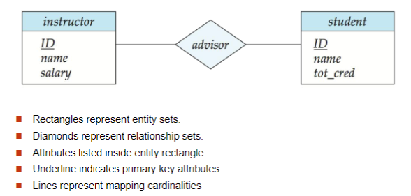

### 不同类型的关系

#### 自关联（递归关系）

实体集可以与自身建立关系，即关系的实体集不必是不同的。

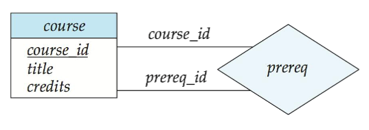

在这种情况下，关系中的每个出现实体集都扮演一个"角色"。上图中的"course_id"和"prereq_id"就是角色。

#### 基数约束表示

在E-R图中，我们通过在关系集和实体集之间绘制有向线（→）表示"一"，或无向线（—）表示"多"来表达基数约束。

下面是不同基数关系的E-R图表示：

##### 一对一关系

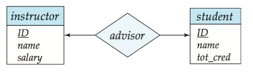

- 通过advisor关系，一个教师最多关联一个学生
- 一个学生最多关联一个教师

##### 一对多关系

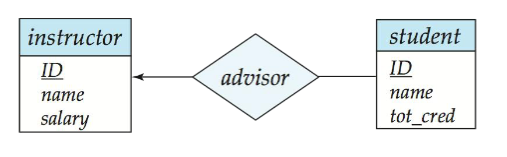

- 通过advisor关系，一个教师可以关联多个（包括0个）学生
- 一个学生最多关联一个教师

##### 多对一关系

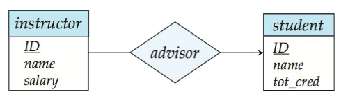

- 通过advisor关系，一个教师最多关联一个学生
- 一个学生可以关联多个（包括0个）教师

##### 多对多关系

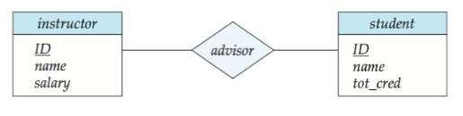

- 通过advisor关系，一个教师可以关联多个（包括0个）学生
- 一个学生可以关联多个（包括0个）教师

#### 参与约束

<div class="grid cards" markdown>

-   :material-account-multiple:{ .lg .middle } __参与约束类型__

    ---
    **全部参与**（用双线表示）：
    实体集中的每个实体都参与关系集中的至少一个关系
    
    例如：section与sec_course的关系是全部参与，因为每个section必须有一个关联的course
    
    **部分参与**（用单线表示）：
    实体集中的一些实体可能不参与关系集中的任何关系
    
    例如：instructor与advisor的关系是部分参与，因为不是所有教师都是导师

</div>

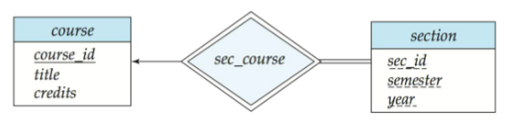

基数限制也可以表达参与约束，如下图所示：

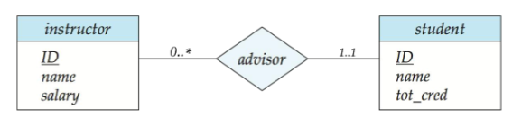

#### 三元关系中的约束

对于三元及更高阶的关系，我们允许最多一个箭头从关系出发来表示基数约束。

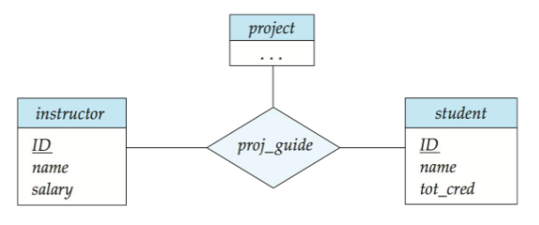

例如，从proj_guide到instructor的箭头表示每个学生在一个项目上最多有一个指导教师。

!!! warning "注意"
    为避免混淆，我们禁止使用多于一个的箭头。

## 弱实体集

<div class="grid cards" markdown>

-   :material-cube-unfolded:{ .lg .middle } __弱实体集概念__

    ---
    **弱实体集**是没有主键的实体集
    
    - 弱实体集的存在依赖于标识实体集（identifying entity set）
    - 必须通过一个总的、一对多的关系集（从标识实体集到弱实体集）来关联
    - 标识关系用双菱形表示
    
    **弱实体集的主键**由标识实体集的主键加上弱实体集的区分符（discriminator或部分键）组成
    
    - 区分符用虚线下划线表示

</div>

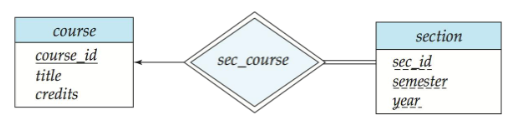

在上图中，section是一个弱实体集，它的存在依赖于course实体集。section的主键是(course_id, sec_id, semester, year)，其中sec_id、semester和year是区分符。

!!! note "注意"
    标识实体集的主键不显式存储在弱实体集中，因为它隐含在标识关系中。如果显式存储，则可以将弱实体集转变为强实体集，但这会导致关系的重复。

## 大学数据库的E-R图

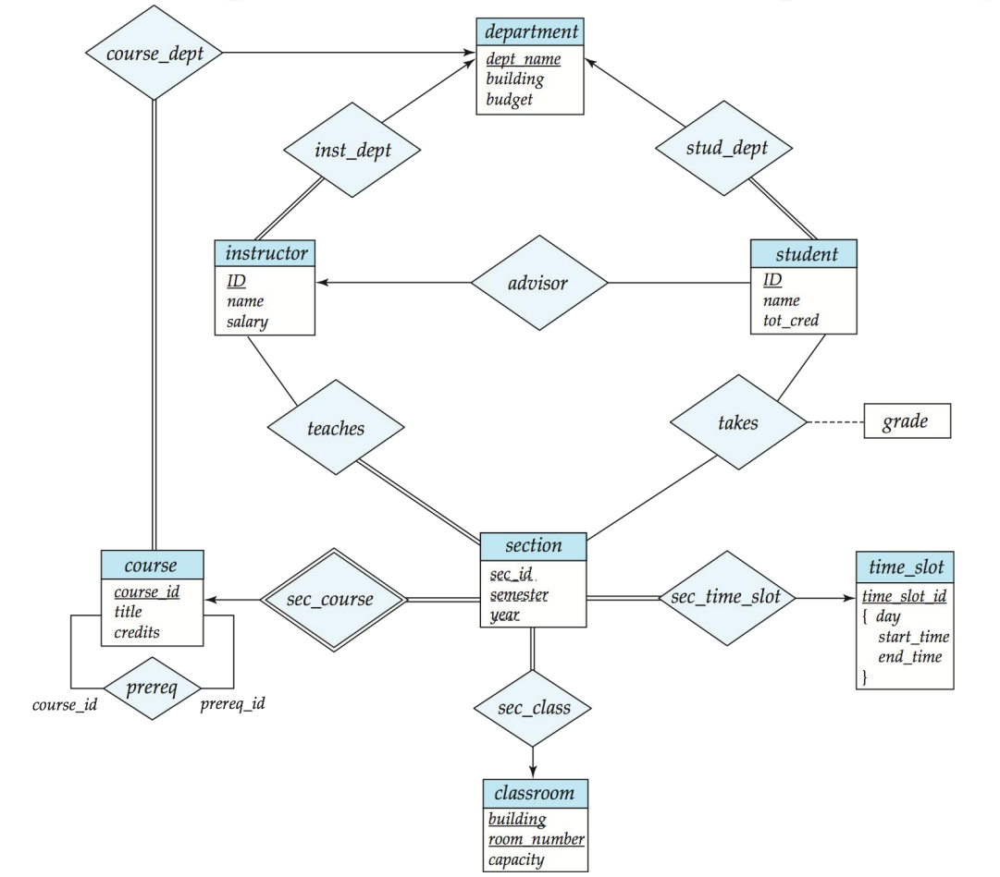

## 转换为关系模式

E-R图可以系统地转换为关系模式（表），以便在关系数据库中实现。

<div class="grid cards" markdown>

-   :material-database-export:{ .lg .middle } __转换基本原则__

    ---
    - 每个实体集和关系集都可以表示为关系模式（表）
    - 对于每个实体集，创建一个与实体集同名的唯一模式
    - 对于关系集，根据映射基数决定是创建新表还是合并到现有表中
    - 对于多值属性，为该属性创建单独的模式
    - 每个模式有多个列（通常对应属性），列名唯一

</div>

### 转换实体集

**强实体集**转换为具有相同属性的表：

```sql
student(ID, name, tot_cred)
```

**弱实体集**转换为包含标识强实体集主键的表：

```sql
section(course_id, sec_id, sem, year)
```

### 转换关系集

**多对多关系集**表示为包含两个参与实体集主键的表，以及关系集的任何描述性属性：

```sql
advisor(s_id, i_id)
```

**多对一和一对多关系集**（在"多"端是全部参与）可以通过在"多"端添加一个额外属性（包含"一"端的主键）来表示：

例如：不需要为inst_dept关系创建单独的表，而是在instructor表中添加dept_name属性。

**一对一关系集**，可以选择任一端作为"多"端：

- 可以将额外属性添加到对应两个实体集的任一表中
- 如果"多"端是部分参与，这可能导致空值

**弱实体集的标识关系**对应的表是冗余的：

- 例如：section表已经包含了sec_course表中的属性

### 转换属性

**复合属性**通过为每个组件属性创建单独的属性来展平：

例如：将实体集instructor中的复合属性name（有first_name和last_name组件）转换为两个属性name_first_name和name_last_name（如果没有歧义，可以省略前缀）。

**多值属性**表示为单独的表：

对于实体E的多值属性M，创建一个模式EM，该模式具有：
- 对应于E的主键的属性
- 对应于多值属性M的属性

例如：instructor的多值属性phone_number表示为：

```sql
inst_phone(ID, phone_number)
```

对于多值属性，每个值映射到关系的单独元组。例如，ID为22222且电话号码为456-7890和123-4567的instructor实体映射到两个元组：(22222, 456-7890)和(22222, 123-4567)。

**特殊情况**：如果实体的唯一非主键属性是多值属性

例如：实体time_slot只有一个除主键外的属性，且该属性是多值的：

优化：不创建对应实体的关系，只创建对应多值属性的关系
```sql
time_slot(time_slot_id, day, start_time, end_time)
```

## 扩展的E-R特性

### 特化与泛化

<div class="grid cards" markdown>

-   :material-chart-timeline-variant:{ .lg .middle } __特化__

    ---
    **特化**是一个自上而下的设计过程，我们在实体集中指定与其他实体不同的子分组。
    
    - 这些子分组成为较低级别的实体集，具有不适用于较高级别实体集的属性或参与关系
    - 使用带有"ISA"标签的三角形组件表示（例如，instructor "是" person）
    - **属性继承**：较低级别的实体集继承较高级别实体集的所有属性和关系参与

-   :material-chart-timeline-variant-shimmer:{ .lg .middle } __泛化__

    ---
    **泛化**是一个自下而上的设计过程，将多个共享相同特性的实体集合并为更高级别的实体集。
    
    特化和泛化只是彼此的简单倒置，在E-R图中以相同方式表示。
    
    这两个术语可以互换使用。

</div>

#### 特化的约束

可以基于不同特征对实体集进行多重特化：

例如：permanent_employee 与 temporary_employee，以及 instructor 与 secretary

<div class="grid cards" markdown>

-   :material-checkbox-multiple-marked-circle:{ .lg .middle } __约束类型__

    ---
    **条件约束**：哪些实体可以成为给定较低级别实体集的成员
    
    - **条件定义**：例如，超过65岁的客户是senior-citizen实体集的成员
    - **用户定义**：由用户明确指定成员资格
    
    **重叠约束**：实体是否可以属于单一泛化内的多个较低级别实体集
    
    - **不相交**：实体只能属于一个较低级别实体集
    - **重叠**：实体可以属于多个较低级别实体集
    
    **完整性约束**：指定较高级别实体集中的实体是否必须属于泛化内的至少一个较低级别实体集
    
    - **全部**：实体必须属于较低级别实体集之一
    - **部分**：实体不必属于任何较低级别实体集

</div>

### 聚合

聚合是一种抽象，允许将关系视为实体。这对于表示关系之间的关系很有用。

<div class="grid cards" markdown>

-   :material-graph-outline:{ .lg .middle } __聚合示例__

    ---
    考虑三元关系proj_guide，连接instructor、student和project
    
    假设我们想记录学生在项目上被指导教师的评估
    
    关系集eval_for和proj_guide表示重叠信息：
    
    - 每个eval_for关系对应一个proj_guide关系
    - 但一些proj_guide关系可能不对应任何eval_for关系
    
    通过聚合可以消除这种冗余：
    
    - 将关系视为抽象实体
    - 允许关系之间的关系
    - 关系的抽象为新实体

</div>

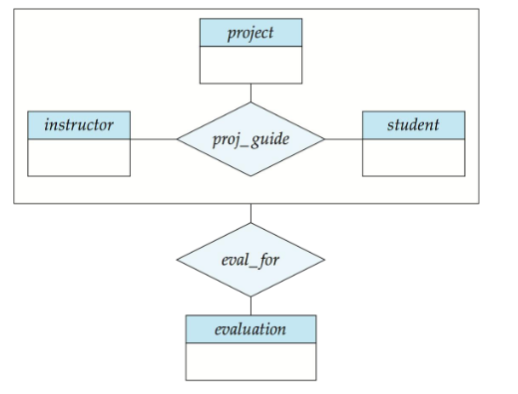

### 转换特化、泛化和聚合

#### 特化/泛化转换

**方法1**：为每个实体集创建单独的表

```
schema         attributes
person         ID, name, street, city
student        ID, tot_cred
employee       ID, salary
```

缺点：获取有关员工的信息需要访问两个关系，低级模式和高级模式对应的关系。

**方法2**：为每个实体集创建表，包含所有本地和继承的属性

```
schema         attributes
person         ID, name, street, city
student        ID, name, street, city, tot_cred
employee       ID, name, street, city, salary
```

如果特化是全部的，则不需要表示泛化实体集（person）的表来存储信息。但是，出于外键约束的需要，可能仍然需要显式模式。

缺点：对于既是学生又是员工的人，name、street和city可能会重复存储。

#### 聚合转换

要表示聚合，创建一个包含以下内容的表：

- 聚合关系的主键
- 相关实体集的主键
- 任何描述性属性

例如，表示关系proj_guide和实体集evaluation之间的聚合eval_for，创建表：

```sql
eval_for(s_ID, project_id, i_ID, evaluation_id)
```

如果我们愿意在eval_for关系中存储属性evaluation_id的空值，则模式proj_guide是冗余的。

## 设计问题

### 实体集与属性的使用

在某些情况下，我们可以使用实体集或属性来建模相同的概念。选择取决于应用程序的需求。

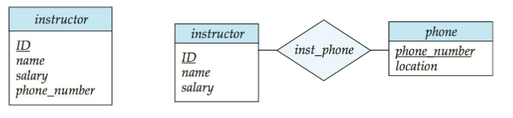

使用phone作为实体允许存储关于电话号码的额外信息（和多个电话号码）。

### 实体集与关系集的使用

可能的指导原则是将关系集指定为描述实体之间发生的动作。


### 二元与n元关系集

虽然可以用多个二元关系集替换任何非二元（n元，n > 2）关系集，但n元关系集更清楚地表明几个实体参与单个关系。

一些看似非二元的关系可能更适合用二元关系表示：

- 例如，三元关系parents（将孩子与父亲和母亲相关联）最好替换为两个二元关系father和mother
- 使用两个二元关系允许部分信息（例如，只知道母亲）

但有些关系本质上是非二元的：

- 例如：proj_guide

通过创建人工实体集，任何非二元关系都可以使用二元关系表示：

1. 用实体集E替换实体集A、B和C之间的关系R，以及三个关系集：
      - RA，关联E和A
      - RB，关联E和B
      - RC，关联E和C

2. 为E创建特殊的标识属性

3. 将R的任何属性添加到E

4. 对于R中的每个关系(ai, bi, ci)，创建：
      - 实体集E中的新实体ei
      - 将(ei, ai)添加到RA
      - 将(ei, bi)添加到RB
      - 将(ei, ci)添加到RC

### 不同的E-R符号

E-R图有多种不同的符号表示法，包括Chen表示法、IDE1FX（乌鸦脚表示法）等。


## 总结

实体-关系模型是一种强大的数据库设计工具，提供了直观的方式来表示数据和它们之间的关系。它的主要优势在于：

1. 易于理解：通过图形表示，使非技术人员也能理解数据库结构
2. 独立于数据库实现：可以映射到任何数据库模型
3. 便于维护：修改设计比修改已实现的数据库更容易
4. 支持复杂关系：可以表示各种类型的关系和约束

通过系统地将E-R图转换为关系模式，我们可以实现在关系数据库中的物理设计，同时保持概念模型的语义完整性。

## pdf资料

<embed src="pdfs/ch6(3).pdf" type="application/pdf" width="100%" height="400px" />