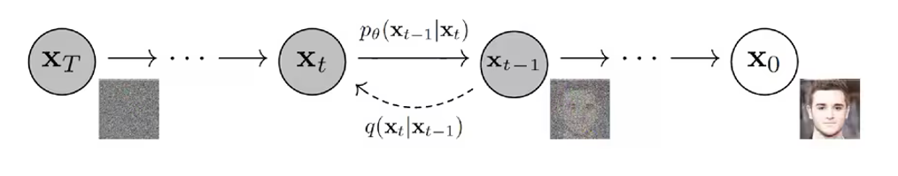

# Denoising Diffusion Implicit Models (DDIM) 阅读笔记

!!! note "论文解读精选"
    [arXiv](https://arxiv.org/pdf/2010.02502)

    

## 总述
本文

## 核心概念

### 扩散模型的基本思想

扩散模型是一种受非平衡热力学启发的潜变量模型。其基本思想是通过两个过程：

1. **前向过程（扩散过程）**：逐步向数据添加噪声
2. **反向过程（去噪过程）**：学习如何从噪声中恢复数据



### 前向过程详解

!!! info "前向过程（扩散过程）"
    1. 给定初始数据分布 $x_0 \sim q(x)$，可以不断地向分布中添加高斯噪声。该噪声的标准差由固定值 $\beta_t$ 确定，均值由固定值 $\beta_t$ 和当前时刻 $t$ 的数据 $x_t$ 决定。此过程是一个马尔可夫链过程。

     2. 随着 $t$ 的不断增大，最终数据分布 $x_T$ 会逐渐变为一个各向同性的高斯分布（各向独立的高斯分布）。

    

=== "参数解释"
    - $x_0$: 原始数据（如图像）
    - $x_t$: 第t步的噪声数据
    - $\beta_t$: 噪声调度参数，控制每一步添加的噪声量
    - $\mathcal{N}$: 高斯分布
    - $I$: 单位矩阵

=== "重要性质"
    任意时刻t的分布可以直接计算(采用了重参数化的技巧)：$q(x_t|x_0) = \mathcal{N}(x_t; \sqrt{\bar{\alpha}_t}x_0, (1-\bar{\alpha}_t)I)$
    其中
        $\alpha_t = 1-\beta_t$, $\bar{\alpha}_t = \prod_{s=1}^t \alpha_s$
    

### 数学推导详解

=== "前向过程重参数化"
    前向过程的关键是可以重参数化为：
    
    $$x_t = \sqrt{\bar{\alpha}_t}x_0 + \sqrt{1-\bar{\alpha}_t}\epsilon$$
    
    其中$\epsilon \sim \mathcal{N}(0, I)$是标准高斯噪声。
    
    这种表示方式使得我们可以在任意时间步t直接从$x_0$采样$x_t$，无需逐步添加噪声。

=== "后验概率计算"
    通过贝叶斯定理和马尔可夫链性质，可以推导出：
    
    $$q(x_{t-1}|x_t, x_0) = \mathcal{N}(x_{t-1}; \tilde{\mu}_t(x_t, x_0), \tilde{\beta}_t I)$$
    
    其中：

    - $\tilde{\mu}_t(x_t, x_0) = \frac{\sqrt{\bar{\alpha}_{t-1}}\beta_t}{1-\bar{\alpha}_t}x_0 + \frac{\sqrt{\alpha_t}(1-\bar{\alpha}_{t-1})}{1-\bar{\alpha}_t}x_t$
    - $\tilde{\beta}_t = \frac{1-\bar{\alpha}_{t-1}}{1-\bar{\alpha}_t}\beta_t$

=== "均值预测简化"
    通过进一步推导，上述均值可以重写为：
    
    $$\tilde{\mu}_t(x_t, x_0) = \frac{1}{\sqrt{\alpha_t}}\left(x_t - \frac{\beta_t}{\sqrt{1-\bar{\alpha}_t}}\epsilon_t\right)$$
    
    其中$\epsilon_t$是添加到$x_0$的噪声。这表明我们可以通过预测噪声$\epsilon_t$来生成逆向过程。

### 反向过程详解

!!! info "反向过程（去噪过程）"
    逆过程是从高斯噪声中恢复原始数据，我们可以假设它也是一个高斯分布，但是无法逐步地去拟合分布，所以需要构建一个参数分布来去做估计。逆扩散过程仍然是一个马尔科夫链过程。

    

=== "参数解释"
    - $\theta$: 神经网络参数
    - $\mu_\theta$: 神经网络预测的均值
    - $\Sigma_\theta$: 神经网络预测的方差
    - $p(x_T)$: 标准高斯分布

=== "关键发现"
    1. 预测噪声比预测均值效果更好
    2. 方差可以固定为$\beta_t$或$\tilde{\beta}_t$
    3. 使用简化的训练目标可以获得更好的样本质量


### 训练目标详解

!!! info "目标数据分布的似然函数"
    在负对数似然函数的基础上加上一个KL散度项，就构成了负对数似然函数的上界，上界越小，负对数似然函数越小，对数似然函数就越大。
    
    进一步可以写出交叉熵的上界，并对交叉熵的上界进行化简：
    

=== "ELBO的重写形式"
    ELBO可以重写为：

    $$L = L_T + \sum_{t>1} L_{t-1} + L_0$$
    
    其中：

    - $L_T = D_{KL}(q(x_T|x_0) \| p(x_T))$
    - $L_{t-1} = D_{KL}(q(x_{t-1}|x_t,x_0) \| p_\theta(x_{t-1}|x_t))$
    - $L_0 = -\log p_\theta(x_0|x_1)$

=== "简化训练目标"
    作者发现使用简化的训练目标可以获得更好的样本质量：

    $$L_{simple}(\theta) := \mathbb{E}_{t,x_0,\epsilon}\left[\|\epsilon - \epsilon_\theta(\sqrt{\bar{\alpha}_t}x_0 + \sqrt{1-\bar{\alpha}_t}\epsilon, t)\|^2\right]$$

=== "训练算法"
    ```python
    # Algorithm 1: Training
    while not converged:
        x_0 = sample_data()              # 采样原始图像
        t = sample_uniform(1, T)         # 采样时间步
        ε = sample_normal()              # 采样噪声
        loss = mse(ε, predict_noise(x_0, t, ε))  # 计算损失
        update_parameters()              # 更新模型参数
    ```

    ```python
    # Algorithm 2: Sampling
    x_T = sample_normal()               # 从标准正态分布采样
    for t in reversed(range(1, T+1)):
        z = 0 if t == 1 else sample_normal()  # 采样噪声
        # 预测并更新x_{t-1}
        x_prev = predict_mean(x_t, t) + σ_t * z
    return x_0
    ```

### 采样算法详解

在DDPM中，完整的采样过程如下：

```python
def sample(model, shape):
    # 从标准正态分布采样初始噪声
    x_T = torch.randn(shape)
    x_t = x_T
    
    # 反向去噪过程
    for t in reversed(range(1, T+1)):
        # 预测噪声
        epsilon = model(x_t, t)
        
        # 计算均值
        alpha_t = 1 - beta[t]
        alpha_bar_t = alpha_bar[t]
        
        # 计算均值和方差
        mean = (1 / math.sqrt(alpha_t)) * (x_t - (beta[t] / math.sqrt(1 - alpha_bar_t)) * epsilon)
        var = beta[t]
        
        # 添加采样噪声（在t=1时不添加噪声）
        z = torch.randn_like(x_t) if t > 1 else 0
        x_t_minus_1 = mean + math.sqrt(var) * z
        x_t = x_t_minus_1
    
    return x_0
```

关键步骤：

1. 从标准正态分布采样初始状态$x_T$
2. 逐步应用学习到的反向过程
3. 通过预测噪声来计算均值和方差
4. 采样下一个状态，直到生成$x_0$

## DDPM的改进

### 加速采样

标准DDPM需要1000步采样，计算量大。改进方法包括：

1. **DDIM (Denoising Diffusion Implicit Model)**：通过确定性采样和跳跃步骤减少采样次数
2. **预测器-校正器方法**：结合ODE和SDE方法提高采样效率
3. **知识蒸馏**：训练更小的模型快速生成样本

### 条件生成

DDPM可以扩展为条件生成模型：

1. **分类器引导采样**：使用分类器梯度指导扩散过程
2. **文本引导扩散**：通过文本条件控制图像生成方向
3. **结构驱动生成**：通过结构信息（如分割图、草图）控制生成结果

## 总结

DDPM扩散概率模型的思想来源是非平衡热力学，通过逐步添加噪声来生成图像。前向过程是一个马尔科夫链，且通过重参数化等推导，使得可以直接用$x_0$对任意的时间步$x_t$进行采样。而反向过程也定义为一个马尔科夫链，用神经网络来拟合真实的后验分布，通过变分法得到优化目标，并通过重参数化来化简优化目标。DDPM的训练目标是最大化ELBO，并通过简化的训练目标来提高采样效率。
但DDPM存在的限制为：要求过程为马尔科夫链，所以很缓慢，且无法处理非马尔科夫链的模型。

=== "主要优势"
    - 样本质量高
    - 训练稳定
    - 实现简单
    - 可解释性强

=== "与其他生成模型的比较"
    | 模型类型 | 优势 | 劣势 |
    |---------|------|------|
    | GAN | 快速采样，高质量样本 | 训练不稳定，模式崩溃 |
    | VAE | 易于训练，良好的表示 | 样本质量较低 |
    | 自回归 | 高精度细节 | 采样慢，序列依赖 |
    | 流模型 | 精确似然，可逆 | 架构受限，计算复杂 |
    | DDPM | 高质量样本，稳定训练 | 采样慢，计算密集 |