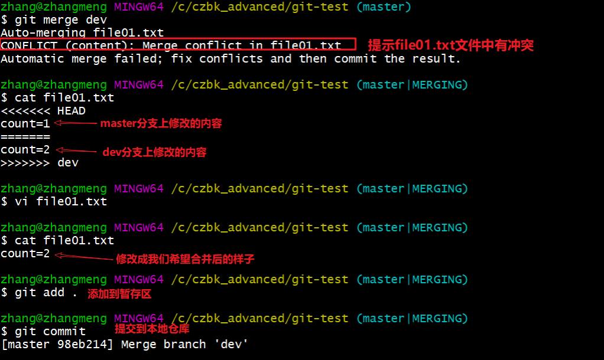
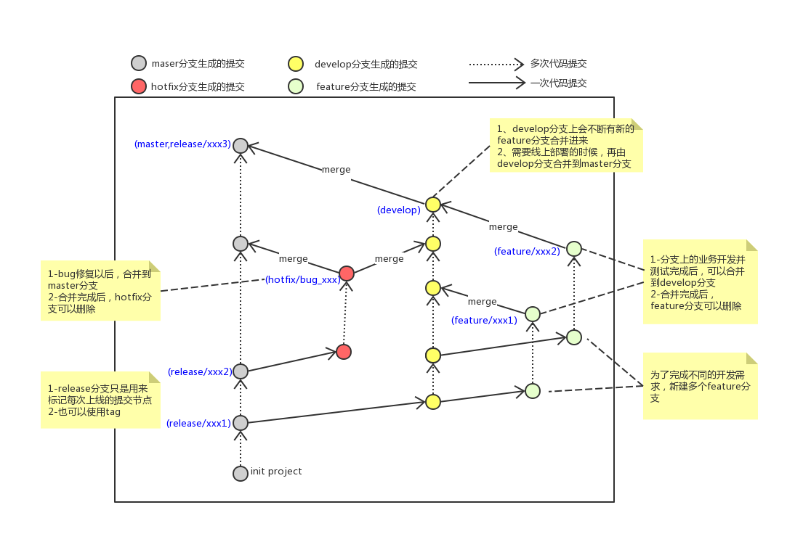
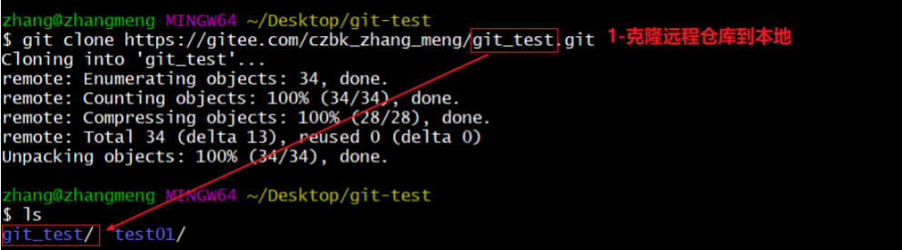

# Git 分布式版本控制工具

## 1. 目标
- 了解 Git 基本概念
- 能够概述 Git 工作流程
- 能够使用 Git 常用命令
- 熟悉 Git 代码托管服务
- 能够使用 Idea 操作 Git

## 2. 概述

### 2.1 开发中的实际场景
- **场景一：备份**  
  小明负责的模块即将完成时，电脑突然蓝屏，硬盘损坏，几个月的努力付之东流。
- **场景二：代码还原**  
  项目中一个复杂功能由老王摸索一周后有眉目，但代码已面目全非，无法回到之前状态。
- **场景三：协同开发**  
  小刚和小强先后从文件服务器下载同一个文件 `Analysis.java`。小刚在第 30 行声明方法 `count()` 并保存，小强在第 50 行声明方法 `sum()` 也保存，导致 `count()` 方法丢失。
- **场景四：追溯问题代码的编写人和编写时间**  
  老王作为项目经理，因项目进度挨骂后，无法确定哪个程序员导致了 Bug，因为相关属性未在应用初始化时赋值，而团队成员都不承认是自己所为。

### 2.2 版本控制器的方式

#### a. 集中式版本控制工具
- 版本库集中存放在中央服务器
- 团队成员工作时从中央服务器下载代码，必须联网（局域网或互联网）
- 个人修改后提交到中央版本库
- 举例：SVN 和 CVS

#### b. 分布式版本控制工具
- 没有“中央服务器”，每个人的电脑上都是一个完整的版本库
- 工作时无需联网，版本库在本地电脑上
- 多人协作只需将各自修改推送给对方即可互相看到修改
- 举例：Git

### 2.3 SVN


### 2.4 Git

Git 是一个开源的分布式版本控制系统，可以有效、高速地处理从很小到非常大的项目版本管理。由 Linus Torvalds 为了帮助管理 Linux 内核开发而开发。


### 2.5 Git 工作流程图


1. **clone（克隆）**：从远程仓库中克隆代码到本地仓库

2. **checkout（检出）**：从本地仓库中检出一个仓库分支然后进行修订

3. **add（添加）**：在提交前先将代码提交到暂存区

4. **commit（提交）**：提交到本地仓库。本地仓库中保存修改的各个历史版本

5. **fetch（抓取）**：从远程库，抓取到本地仓库，不进行任何的合并动作，一般操作比较少

6. **pull（拉取）**：从远程库拉到本地库，自动进行合并（merge），然后放到工作区，相当于 fetch+merge

7. **push（推送）**：修改完成后，需要和团队成员共享代码时，将代码推送到远程仓库

## 3. Git 安装与常用命令

### 3.1 Git 环境配置

#### 3.1.1 下载与安装
下载地址：<https://git-scm.com/download>  
安装完成后在电脑桌面（也可以是其他目录）点击右键，如果能够看到如下两个菜单则说明 Git 安装成功：
- Git GUI：Git 提供的图形界面工具
- Git Bash：Git 提供的命令行工具

#### 3.1.2 基本配置
1. 打开 Git Bash
2. 设置用户信息
   ```bash
   git config --global user.name “itcast”
   git config --global user.email “hello@itcast.cn”
   ```

1. 查看配置信息

	bash复制

	```bash
	git config --global user.name
	git config --global user.email
	```

#### 3.1.3 为常用指令配置别名（可选）

1. 打开用户目录，创建 `.bashrc` 文件

	bash复制

	```bash
	touch ~/.bashrc
	```

2. 在 `.bashrc` 文件中输入如下内容：

	bash复制

	```bash
	# 用于输出 git 提交日志
	alias git-log='git log --pretty=oneline --all --graph --abbrev-commit'
	# 用于输出当前目录所有文件及基本信息
	alias ll='ls -al'
	git config --global core.quotepath false
	export LANG="zh_CN.UTF-8"
	export LC_ALL="zh_CN.UTF-8"
	```

3. 打开 GitBash，执行

	bash复制

	```bash
	source ~/.bashrc
	```

#### 3.1.4 解决 GitBash 乱码问题

1. 打开 GitBash 执行下面命令

```
git config --global core.quotepath false
```

2. `${git_home}/etc/bash.bashrc` 文件最后加入下面两行

```
export LANG="zh_CN.UTF-8"
export LC_ALL="zh_CN.UTF-8"
```

### 3.2 获取本地仓库

要使用 Git 对代码进行版本控制，首先需要获得本地仓库

1. 在电脑的任意位置创建一个空目录（例如 test）作为本地 Git 仓库
2. 进入这个目录中，点击右键打开 Git bash 窗口
3. 执行命令 `git init`
4. 如果创建成功后可在文件夹下看到隐藏的 `.git` 目录。

### 3.3 基础操作指令

Git 工作目录下对于文件的修改（增加、删除、更新）会存在几个状态，这些修改的状态会随着执行 Git 的命令而发生变化。

#### 3.3.1 *查看修改的状态（status）

作用：查看的修改的状态（暂存区、工作区） 命令形式：`git status`

#### 3.3.2 *添加工作区到暂存区（add）

作用：添加工作区一个或多个文件的修改到暂存区 命令形式：`git add 单个文件名|通配符`
将所有修改加入暂存区：`git add .`

#### 3.3.3 *提交暂存区到本地仓库（commit）

作用：提交暂存区内容到本地仓库的当前分支 命令形式：`git commit -m '注释内容'`

#### 3.3.4 *查看提交日志（log）

在 3.1.3 中配置的别名 `git-log` 就包含了这些参数，所以后续可以直接使用指令 `git-log`
作用：查看提交记录
命令形式：`git log [option]`
options：

- `--all` 显示所有分支

- `--pretty=oneline` 将提交信息显示为一行

- `--abbrev-commit` 使得输出的 commitId 更简短

- `--graph` 以图的形式显示

	`git log --pretty=oneline --abbrev-commit --all --graph`

#### 3.3.5 版本回退

- 作用：版本切换

- 命令形式：`git reset --hard commitID`
	- commitID 可以使用 `git-log` 或 `git log` 指令查看

- 如何查看已经删除的记录？
	- `git reflog` 这个指令可以看到已经删除的提交记录

#### 3.3.6 添加文件至忽略列表

一般我们总会有些文件无需纳入 Git 的管理，也不希望它们总出现在未跟踪文件列表。通常都是些自动生成的文件，比如日志文件，或者编译过程中创建的临时文件等。在这种情况下，我们可以在工作目录中创建一个名为 `.gitignore` 的文件（文件名称固定），列出要忽略的文件模式。下面是一个示例：

```plaintext
# no .a files
*.a
# but do track lib.a, even though you're ignoring .a files above
!lib.a
# only ignore the TODO file in the current directory, not subdir/TODO
/TODO
# ignore all files in the build/ directory
build/
# ignore doc/notes.txt, but not doc/server/arch.txt
doc/*.txt
# ignore all .pdf files in the doc/ directory
doc/**/*.pdf
```

### 3.4 分支

#### 3.4.1 查看本地分支

命令：`git branch`

#### 3.4.2 创建本地分支

命令：`git branch 分支名`

#### 3.4.4 切换分支（checkout）

命令：`git checkout 分支名`
我们还可以直接切换到一个不存在的分支（创建并切换）
命令：`git checkout -b 分支名`

#### 3.4.6 合并分支（merge）

一个分支上的提交可以合并到另一个分支
命令：`git merge 分支名称`

#### 3.4.7 删除分支

不能删除当前分支，只能删除其他分支
`git branch -d b1` 删除分支时，需要做各种检查
`git branch -D b1` 不做任何检查，强制删除

#### 3.4.8 解决冲突

当两个分支上对文件的修改可能会存在冲突，例如同时修改了同一个文件的同一行，这时就需要手动解决冲突，解决冲突步骤如下：

1. 处理文件中冲突的地方
2. 将解决完冲突的文件加入暂存区（add）
3. 提交到仓库（commit）



#### 3.4.9 开发中分支使用原则与流程

几乎所有的版本控制系统都以某种形式支持分支。使用分支意味着你可以把你的工作从开发主线上分离开来进行重大的 Bug 修改、开发新的功能，以免影响开发主线。在开发中，一般有如下分支使用原则与流程：

- **master（生产）分支**：线上分支，主分支，中小规模项目作为线上运行的应用对应的分支；
- **develop（开发）分支**：是从 master 创建的分支，一般作为开发部门的主要开发分支，如果没有其他并行开发不同期上线要求，都可以在此版本进行开发，阶段开发完成后，需要是合并到 master 分支，准备上线。
- **feature/xxxx 分支**：从 develop 创建的分支，一般是同期并行开发，但不同期上线时创建的分支，分支上的研发任务完成后合并到 develop 分支。
- **hotfix/xxxx 分支**：从 master 派生的分支，一般作为线上 bug 修复使用，修复完成后需要合并到 master、test、develop 分支。 还有一些其他分支，在此不再详述，例如 test 分支（用于代码测试）、pre 分支（预上线分支）等等。



## 4. Git 远程仓库

### 4.1 常用的托管服务[远程仓库]

前面我们已经知道了Git中存在两种类型的仓库，即本地仓库和远程仓库。那么我们如何搭建Git远程仓库呢？我们可以借助互联网上提供的一些代码托管服务来实现，其中比较常用的有GitHub、码云、GitLab等。

- gitHub（ 地址：https://github.com/ ）是一个面向开源及私有软件项目的托管平台，因为只支持Git 作为唯一的版本库格式进行托管，故名gitHub

- 码云（地址： https://gitee.com/ ）是国内的一个代码托管平台，由于服务器在国内，所以相比于GitHub，码云速度会更快

- GitLab （地址： https://about.gitlab.com/ ）是一个用于仓库管理系统的开源项目，使用Git作为代码管理工具，并在此基础上搭建起来的web服务,一般用于在企业、学校等内部网络搭建git私服。

### 4.2 注册码云

要想使用码云的相关服务，需要注册账号（地址：https://gitee.com/signup）

### 4.3 创建远程仓库


仓库创建完成后可以看到仓库地址，如下图所示：


### 4.4 配置 SSH 公钥

- 生成 SSH 公钥
	- `ssh-keygen -t rsa`
	- 不断回车
		- 如果公钥已经存在，则自动覆盖
- Gitee 设置账户公共钥
	- 获取公钥
		- `cat ~/.ssh/id_rsa.pub`
	- 
		- 验证是否配置成功
			`ssh -T git@gitee.com`

### 4.5 操作远程仓库

#### 4.5.1 添加远程仓库

此操作是先初始化本地库，然后与已创建的远程库进行对接。

- 命令：`git remote add <远端名称> <仓库路径>`
	- 远端名称，默认是 origin，取决于远端服务器设置
	- 仓库路径，从远端服务器获取此 URL
	- 例如：`git remote add origin git@gitee.com:czbk_zhang_meng/git_test.git`

#### 4.5.2 查看远程仓库

- 命令：`git remote`

#### 4.5.3 推送到远程仓库

- 命令：`git push [-f] [--set-upstream] [远端名称 [本地分支名][:远端分支名] ]`
	- 如果远程分支名和本地分支名称相同，则可以只写本地分支
		`git push origin master`
	- `-f` 表示强制覆盖
	- `--set-upstream` 推送到远端的同时并且建立起和远端分支的关联关系。
		- `git push --set-upstream origin master`
	- 如果当前分支**已经和远端分支关联**，则可以省略分支名和远端名。 
		- `git push` 将 master 分支推送到已关联的远端分支。


#### 4.5.4 **本地分支与远程分支的关联关系**

- 查看关联关系我们可以使用 `git branch -vv` 命令


#### 4.5.5 从远程仓库克隆

如果已经有一个远端仓库，我们可以直接 clone 到本地。

- 命令：`git clone <仓库路径> [本地目录]`
	- 本地目录可以省略，会自动生成一个目录



#### 4.5.6 从远程仓库中抓取和拉取

远程分支和本地的分支一样，我们可以进行 merge 操作，只是需要先把远端仓库里的更新都下载到本地，再进行操作。

- 抓取 命令：`git fetch [remote name] [branch name]`
	- **抓取指令就是将仓库里的更新都抓取到本地，不会进行合并**
	- 如果不指定远端名称和分支名，则抓取所有分支。
- 拉取 命令：`git pull [remote name] [branch name]`
	- 拉取指令就是将远端仓库的修改拉到本地并自动进行合并，**等同于 fetch+merge**
	- 如果不指定远端名称和分支名，则抓取所有并更新当前分支。


#### 4.5.8 解决合并冲突

在一段时间，A、B 用户修改了同一个文件，且修改了同一行位置的代码，此时会发生合并冲突。
A 用户在本地修改代码后优先推送到远程仓库，此时 B 用户在本地修订代码，提交到本地仓库后，也需要推送到远程仓库，此时 B 用户晚于 A 用户，**故需要先拉取远程仓库的提交，经过合并后才能推送到远端分支**，如下图所示。


在 B 用户拉取代码时，因为 A、B 用户同一段时间修改了同一个文件的相同位置代码，故会发生合并冲突。
**远程分支也是分支，所以合并时冲突的解决方式也和解决本地分支冲突相同**。

**练习：**

```
##########################1-将本地仓库推送到远程仓库
# 完成4.1、4.2、4.3、4.4的操作
略
# [git_test01]添加远程仓库
git remote add origin git@gitee.com/**/**.git
# [git_test01]将master分支推送到远程仓库,并与远程仓库的master分支绑定关联关系
git push --set-upstream origin master
###########################2-将远程仓库克隆到本地
# 将远程仓库克隆到本地git_test02目录下
git clone git@gitee.com/**/**.git git_test02
# [git_test02]以精简的方式显示提交记录
git-log
###########################3-将本地修改推送到远程仓库
# [git_test01]创建文件file03.txt
略
# [git_test01]将修改加入暂存区并提交到仓库,提交记录内容为：add file03
git add .
git commit -m 'add file03'
# [git_test01]将master分支的修改推送到远程仓库
git push origin master
###########################4-将远程仓库的修改更新到本地
# [git_test02]将远程仓库修改再拉取到本地
git pull
# 以精简的方式显示提交记录
git-log
# 查看文件变化(目录下也出现了file03.txt)
略
```


## 5. 在 Idea 中使用 Git

### 5.1 在 Idea 中配置 Git

安装好 IntelliJ IDEA 后，如果 Git 安装在默认路径下，那么 idea 会自动找到 git 的位置，如果更改了 Git 的安装位置则需要手动配置下 Git 的路径。选择 File→Settings 打开设置窗口，找到 Version Control 下的 git 选项：
点击 Test 按钮，现在执行成功，配置完成

### 5.2 在 Idea 中操作 Git

场景：本地已经有一个项目，但是并不是 git 项目，我们需要将这个放到码云的仓库里，和其他开发人员继续一起协作开发。

#### 5.2.1 创建项目远程仓库（参照 4.3）

#### 5.2.2 初始化本地仓库

#### 5.2.3 设置远程仓库

#### 5.2.4 提交到本地仓库

#### 5.2.6 推送到远程仓库

#### 5.2.7 克隆远程仓库到本地

#### 5.2.8 创建分支

- 最常规的方式
- 最强大的方式

#### 5.2.9 切换分支及其他分支相关操作

#### 5.2.11 解决冲突

1. 执行 merge 或 pull 操作时，可能发生冲突
2. 冲突解决后加入暂存区
3. 提交到本地仓库
4. 推送到远程仓库

### 5.3 IDEA 常用 GIT 操作入口

1. 第一张图上的快捷入口可以基本满足开发的需求。
2. 第二张图是更多在 IDEA 操作 git 的入口。

### 5.4 场景分析

基于我们后面的实战模式，我们做一个综合练习
当前的开发环境如下，我们每个人都对这个项目已经开发一段时间，接下来我们要切换成团队开发模式。也就是我们由一个团队来完成这个项目实战的内容。团队有组长和若干组员组成（组长就是开发中的项目经理）。所有操作都在 idea 中完成。
练习场景如下：

1. 由组长，基于本项目创建本地仓库；创建远程仓库，推送项目到远程仓库。
2. 每一位组员从远程仓库克隆项目到 idea 中，这样每位同学在自己电脑上就有了一个工作副本，可以正式的开始开发了。我们模拟两个组员（组员 A、组员 B），克隆两个工作区。
3. 组员 A 修改工作区，提交到本地仓库，再推送到远程仓库。组员 B 可以直接从远程仓库获取最新的代码。
4. 组员 A 和组员 B 修改了同一个文件的同一行，提交到本地没有问题，但是推送到远程仓库时，后一个推送操作就会失败。
	解决方法：需要先获取远程仓库的代码到本地仓库，编辑冲突，提交并推送代码。

## 附：几条铁令

1. 切换分支前先提交本地的修改
2. 代码及时提交，提交过了就不会丢
3. 遇到任何问题都不要删除文件目录，第一时间找老师

## 附：疑难问题解决

1. windows 下看不到隐藏的文件（.bashrc、.gitignore）
2. windows 下无法创建 .ignore|.bashrc 文件
	这里以创建 .ignore 文件为例：
	在 git 目录下打开 gitbash
	执行指令 `touch .gitignore`
